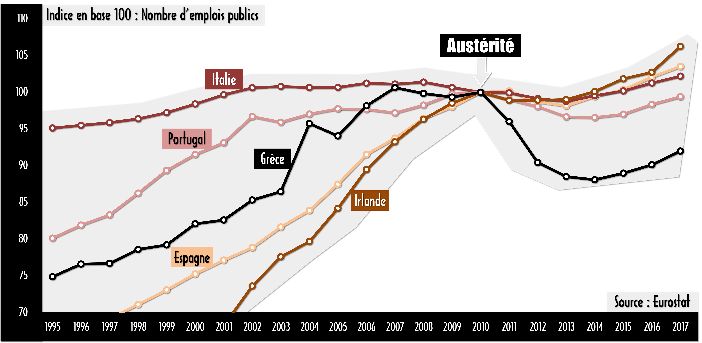
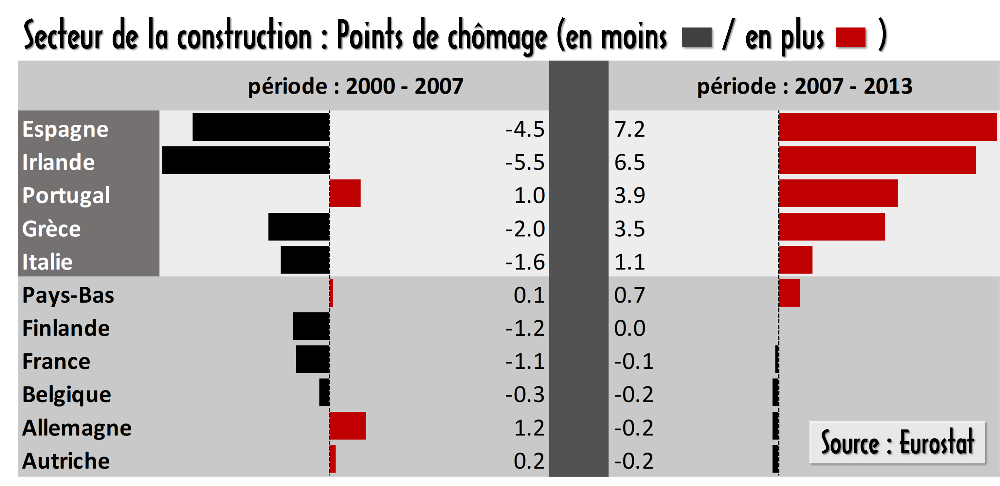

# Episode 24-9 : EVERYOOONE!!!

## Récap de l'épisode

Source 1 : **PIB, Niveau d'inflation et Population** / Debt Economics.org **Review the data** [Lien](http://debt-economics.org/review-data.php)

Source 2 : **Indice de complexité** The Atlas of Economic Complexity **Classement** [Lien](http://atlas.cid.harvard.edu/rankings)

Classer les pays en fonction de leur niveau de développement - ici en utilisant l’indice de complexité développé par Harvard et le niveau de PIB/habitant - permet déjà de mettre en avant, dans une union monétaire où les capitaux sont libres, les pays qui sont les plus exposés à un effet de panique qui les priverait de la capacité d’investissement du secteur privé. Ici on comprend bien que la Grèce et le Portugal sont des pays à risque. L’Espagne l’est dans une moindre mesure et l’Italie encore un peu moins. L’Irlande, pour sa part, semble complètement à l’écart. Son seul problème c’est d’être un petit pays, donc un pays facile à éviter si besoin.

---

Source : fred.stlouisfed.org **Harmonized Unemployment Rate: Total: All Persons for Spain** [Lien](https://fred.stlouisfed.org/series/LRHUTTTTESM156S)

*Commentaire* : Ici je donne l'exemple de l'Espagne. Il suffit de copier coller "Harmonized Unemployment Rate: Total: All Persons for" dans la barre de recherche et de rajouter le pays pour obtenir les données voulues.

Finalement on peut résumer la situation au travers d’un tableau. L’attractivité économique des différents pays du sud est un premier moyen d’expliquer la fuite des capitaux. Ensuite, vient le rôle de la bulle de l’immobilier. L’Espagne et l’Irlande ont été les deux seules victimes. Côté austérité, tous les pays ont souffert, mais force est de constater que c’est la Grèce qui a dû mettre en place les réformes les plus drastiques. En additionnant tout cela, on peut à peu près comprendre l’impact de la crise sur les taux de chômage dans les pays du sud.

---

Maintenant je vais essayer de résumer rapidement ce qui s’est passé dans chacun de ces pays.

Source 1 : **Niveau de dette publique** / Debt Economics.org **Review the data** [Lien](http://debt-economics.org/review-data.php)

Source 2 : **Surplus/Déficit public** Trading Economics **Greece Government Budget** [Lien](https://tradingeconomics.com/greece/government-budget)

*Commentaire* : Ici je donne l'exemple de la Grèce. Il suffit de copier coller "Government Budget" dans la barre de recherche et de rajouter le pays pour obtenir les données voulues.

---

### Grèce ###

En Grèce, le pays est coupé des marchés financier en premier parce que la situation financière de son gouvernement est la pire de toute la Zone euro. Les mesures d’austérité, trop importantes dès le début, font l’inverse de ce qui était attendu. Le pays s’enfonce dans la récession, les marchés financiers ne changent pas d’avis quant au financement de l’Etat grec et la Troika se retrouve obligée de supporter presque l’ensemble de la dette du pays. D’où la nécessité d’une aide massive de plusieurs centaines de milliards d’euros.

Source : Eurostat **Emploi par A*10 branches** [Lien](http://ec.europa.eu/eurostat/web/products-datasets/product?code=nama_10_a10_e)

*Commentaire* : Eurostat ne fait pas la distinction entre emplois publics et privés et se contente de faire un classement par secteur. Mon graphique tient compte des catégories suivantes : **ADMINISTRATION PUBLIQUE, SANTÉ HUMAINE ET ACTION SOCIALE, ENSEIGNEMENT**. Mon graphique considère donc que tous les emplois dans ces secteurs sont publics. Pourtant, il existe des hôpitaux privés, des écoles privés etc. La conclusion que je tire : "Les emplois publics n'ont pas diminué sauf en Grèce" me semble justifier car la majorité des emplois dans ces secteurs sont **probablement** publics. Cela dit, je n'ai pas vérifié si c'était effectivement le cas dans tous les pays européens.

---

### Irlande ###

En Irlande, le pays connait une forte augmentation du chômage à cause d’une bulle de l’immobilier qui éclate alors que le secteur de la construction était très dynamique. Cette bulle fait également voler en éclat les 3 plus grosses banques irlandaises qui avaient massivement investi dans des projets immobiliers. L’Etat irlandais, pourtant dans une situation financière excellente avant la crise, se retrouve obligé d’aider les chômeurs tout en sauvant les banques. Son déficit et sa dette augmentent, les marchés coupent rapidement les vivres au pays, notamment parce que c’est un petit pays, et la Troika doit intervenir. La situation s’améliore rapidement en Irlande avec un retour de l’investissement privé parce que le pays conserve toutes les caractéristiques d’un pays du nord, plus au moins deux avantages : une population qui parle anglais et un taux d’imposition sur les sociétés très attractif.

Source : Eurostat **Emploi par A*10 branches** [Lien](http://ec.europa.eu/eurostat/web/products-datasets/product?code=nama_10_a10_e)

---

### Espagne ###

Pour l’Espagne, qui a également développé une bulle de l’immobilier, l’éclatement de cette dernière ainsi que sa position « officielle » de pays du sud font fuir les capitaux et augmenter le chômage, ce qui provoque une augmentation des dépenses publiques pour soutenir la population sans emploi.

Source : **The Economist house-price index** [Lien](https://infographics.economist.com/2017/HPI/index.html)

Dans le même temps, les recettes fiscales diminuent à cause du ralentissement de l’activité économique. Ainsi, petit à petit, la situation financière du gouvernement espagnol, pourtant excellente en 2007, devient de plus en plus inquiétante. Cela dit, jamais les marchés ne coupent les vivres au pays. D’abord parce que son déficit public ne monte jamais aussi haut qu’en Irlande ou qu’en Grèce. Egalement parce que son niveau de dette reste longtemps le plus faible de tous les pays du sud, mais aussi parce que l’Espagne n’est pas un petit pays. Pour les financiers, éviter la dette souveraine espagnole n’est pas une mince affaire. Malgré cela, la Troika est suffisamment inquiète pour intervenir en 2012 afin d’aider le pays à sauver ses banques. Cependant, parce que les trois grosses banques espagnoles, plus internationales que les banques Irlandaises, n’ont pas besoin d’être sauvée, et car celles qui en ont besoin, les caisses d’épargnes, sont mieux capitalisées que les banques irlandaises, l’aide de la Troika est relativement faible.

Cela dit, étant donnés les prêts garantis qui empêchent les particuliers de faire défaut, la santé des banques espagnoles est difficile à évaluer et les marchés financiers sont méfiants.

Source : The New York Times **In Spain, Homes Are Taken but Debt Stays** [Lien](https://www.nytimes.com/2010/10/28/world/europe/28spain.html)

---

### Portugal ###

Au Portugal, comme en Grèce, c’est la situation financière du pays qui pose problème. Sans être aussi endetté ni aussi déficitaire que l’Etat grec, le gouvernement portugais réagi à la fuite des capitaux et aux emplois ouvrier détruits comme tout le monde : il augmente ses dépenses publiques d’ordre social. Et comme tout le monde, son déficit et sa dette augmentent. Les marchés financiers n’apprécient pas. Et comme le pays est petit et facilement évitable, ils décident de lui couper les vivres, ce qui force la Troika à intervenir. Cela dit, les mesures d’austérité sont moins importantes qu’en Grèce, et le pays ne connait pas une récession aussi brutale.

---

### Italie ###

Enfin en Italie, le problème vient essentiellement de la division du pays en deux régions distinctes : celle du nord, développée, complexe, et qui attire les capitaux, et celle du sud qui a beaucoup plus de mal à s’en sortit économiquement. Le chômage augmente en Italie pendant la crise principalement à cause des régions du sud.

Source : Eurostat **Unemployment rates by sex, age and metropolitan regions / met_lfu3rt** [Lien](http://appsso.eurostat.ec.europa.eu/nui/submitViewTableAction.do)

Les marchés financiers sont méfiants vis-à-vis du secteur bancaire dans ce pays, comme dans n’importe quel pays qui a connu une forte augmentation du chômage. Car qui dit chômage, dit baisse des revenus, donc difficultés à rembourser les emprunts. De plus, l’Italie est un pays très peuplé. Le sauvetage de son secteur bancaire pourrait nécessiter des montants très important. Cela pourrait passer si le gouvernement Italien avait un budget équilibré et une dette relativement modeste, mais ce n’est pas le cas. Le pays reste encore aujourd’hui le deuxième pays de la Zone euro le plus endetté après la Grèce.

---

### Les emplois publics représentent une base d'emplois stables ###

Pour finir, l’importance du secteur public en termes d’emplois et sa capacité à continuer d’embaucher ou au moins, à éviter de licencier, enfin sauf en Grèce, a probablement permis à de nombreux pays, Nord et Sud, de passer à côté d’une crise beaucoup plus grave.

Source : Eurostat **Emploi par A*10 branches** [Lien](http://ec.europa.eu/eurostat/web/products-datasets/product?code=nama_10_a10_e)

---

### En termes de chômage, les secteurs les plus affectés sont ouvriers... ###

Ensuite, si on regarde les secteurs d’activités les plus impactés par les destructions d’emplois, on se rend compte que le monde ouvrier a énormément souffert. Non seulement l’Europe était déjà en train d’opérer une mutation vers les services et avait tendance à se débarrasser de ses emplois ouvriers avant la crise, sauf cas particulier du secteur de la construction. Mais pendant la crise, l’impact a été encore plus important. Particulièrement dans les pays du sud.

---

### ...mais les emplois liés au secteur du commerce ont également reculé ###

Enfin, pour ce qui est du secteur du « commerce », il s’agit d’activités qui sont toujours impactées quand la consommation au sein d’un pays ralenti. Puisqu’il y a eu beaucoup de chômage dans les pays du sud, les commerces de proximité et les magasins de grande distribution ont vu leurs chiffres d’affaires se réduire et ont été obligés de licencier.

### Les livres qui m'ont permis de réaliser cette série sur la crise de l'Euro

Adults in the room - **Yanis Varoufakis**

The Euro crisis and its aftermath - **Jean Pisani-Ferry**

Austerity: the history of a dangerous idea - **Mark Blyth**

Illusion financière - **Gaël Giraud**
