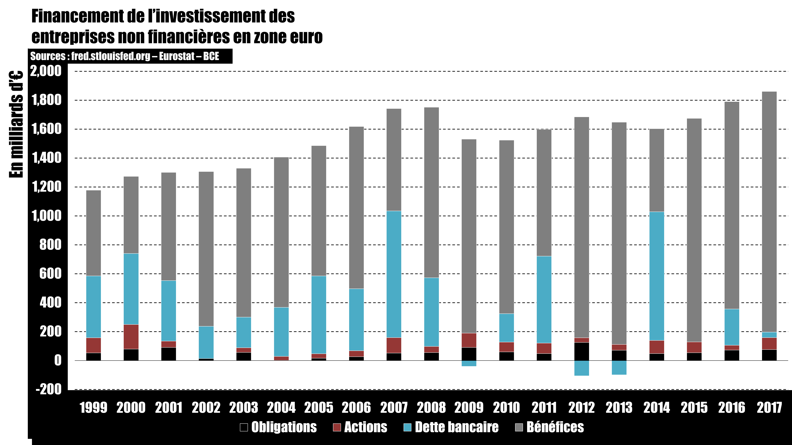

# SPOILER ALERT!!! Episode 24-10 : La crise de l'€ - Ordolibéralisme Allemand

## Refaire mon graph sur le financement des entreprises non-financières par les marchés financiers.

## Pourquoi ce graph ?

L'idée est de savoir à quel point les marchés financiers financent l'économie réelle. On peut répondre à cette question de différentes manières. On pourrait comparer les flux sortants avec les flux entrants sur les marchés. Cela correspond aux émissions nettes d'actions (actions émises moins actions rachetées) et d'obligations (obligations émisent moins obligations remboursées) qu'il faut comparer à la collecte nette par les fonds d'investissements (placements moins retraits). Les données sur les fonds d'investissement étants très difficiles à trouver, j'ai pensé à autre chose.

Il existe un indicateur appelé FBCF (formation brute de capital fixe) qui est la donnée comptable qui correspond au flux d'investissement des entreprises. On peut essayer de comparer le montant de ces investissements avec les émissions nettes d'obligations et d'actions. On peut même aller chercher les données d'endettement total des entreprises pour trouver les flux de dettes non-issue des marchés. On en déduit les flux d'investissements liés aux réinvestissements des bénéfices.

[Lien](http://debt-economics.org/review-data.php)

Les données : [EUROSTAT](https://ec.europa.eu/eurostat/data/database)

1/ Base de données par thème

2/ Economie et finances

3/ Comptes natinaux (SEC 2010)

4/ Ventilation princiale des aggrégats du PIB et de l'emploi (par branche et type d'actif)

5/ Formation brute de capital fixe par AN_F6 types d'actifs

Puis ne pas oublier de vérifier qu'on regarde bien les "Actifs fixes totales" et que les données sont en "Prix courants, millions d'euros"

Ensuite il faut obtenir les flux d'endettement des entreprises non-financières. On trouve ces donnée sur le site de la Fred.

Les données : [FRED -  Total Credit to Non-Financial Sector, Adjusted for Breaks, for Euro Area](https://fred.stlouisfed.org/series/QXMCAM770A)

Les données obtenues sont un stock de dette. Il ne faut pas oublier de faire la soustraction d'une année sur l'autre pour avoir les flux.

Puis il faut obtenir les flux nets d'émissions d'actions et d'obligations. Pour ces données, il faut aller voir du côté de la BCE.

Obligations : [BCE -  Emissions nettes d'obligations en zone euro](https://sdw.ecb.europa.eu/browseTable.do?df=true&ec=&dc=&oc=&pb=&rc=&DATASET=0&removeItem=&removedItemList=&mergeFilter=&activeTab=SEC&showHide=&REF_AREA.41=I8&SEC_ISSUING_SECTOR.41=1100&SEC_ITEM.41=F33000&CURRENCY_TRANS.41=Z01&MAX_DOWNLOAD_SERIES=500&SERIES_MAX_NUM=50&node=9691439&legendRef=reference)

Actions : [BCE -  Emissions nettes d'actions en zone euro](https://sdw.ecb.europa.eu/browseTable.do?df=true&ec=&dc=&oc=&pb=&rc=&DATASET=0&removeItem=&removedItemList=&mergeFilter=&activeTab=SEC&showHide=&REF_AREA.41=I8&SEC_ISSUING_SECTOR.41=1000&CURRENCY_TRANS.41=Z01&MAX_DOWNLOAD_SERIES=500&SERIES_MAX_NUM=50&node=9691445&legendRef=reference)

Maintenant : FCBF - Flux de dette bancaire - Actions - Obligations = Réinvestissement des profits.
Donc : FBCF - (Flux de dette - Obligations) - Actions - Obligations = Réinvestissement des profits.

Et normalement vous devriez avoir ça :

## Récap de l'épisode
La zone euro et plus largement l’Union Européenne a été construite en accord avec une pensée économique, une idéologie économique, appelée ordo-libéralisme. Il s’agit d’une pensée née en Suisse dans les années 1930, qui a guidé le développement économique de l’Allemagne et aussi du Japon, et qui est aujourd’hui LE modèle économique de la zone euro.
L’ordo-libéralisme est une pensée très peu flexible. Il s’agit d’un libéralisme fondé sur l’ordre, ordo, le respect des règles. Et il existe 4 règles fondamentales, je j’ai appelé piliers de l’ordo-libéralisme.
Numéro 1 : seules les entreprises sont à même de créer de la richesse. Le seul et unique rôle de l’état est d’organiser une concurrence juste et non faussée.
Numéro 2 : l’état ne doit jamais entretenir de déficit budgétaire. En effet, le déficit c’est l’endettement, donc l’investissement… avec comme objectif un retour sur investissement, donc une création de richesse. Or, on l’a dit juste avant, seules les entreprises peuvent créer de la richesse.
Numéro 3 : les entreprises créatrices de richesse doivent pouvoir investir, donc entretenir des déficits, donc s’endetter. Ainsi, les ménages sont encouragés à épargner un maximum afin que les banques et les marchés financiers puissent financer les déficits privés.
Et enfin numéro 4 : l’inflation est le pire de tous les maux car la hausse des prix entraîne la perte de valeur de l’épargne accumulée. Une situation perçue comme tellement anxiogène qu’elle bloquer complètement toute l’économie. Or, comme seule la création monétaire entraîne l’inflation, il faut encadrer par des règles strictes l’entité responsable de la planche à billets : la banque centrale. On la veut indépendante du pouvoir politique et avec comme seul objectif : la maitrise de l’inflation.

En suivant ces 4 règles à la lettre, l’ordo-libéralisme entend permettre le meilleur développement économique possible.

Cela-dit, ce modèle a de nombreuses failles. D’abord, il fait des hypothèses qui ne sont absolument vérifiées : il n’est pas prouvé que la concurrence soit toujours la meilleure voie à suivre pour créer de la richesse. De quelles richesses parle-t-on ? Quels sont les indicateurs qui permettent de la mesurer ? etc. Il ne s’agit ici que d’un dogme. Or, sans cette première hypothèse, le corolaire sur l’interdiction de déficit budgétaire de l’état n’a plus aucun sens. Tant qu’on ne peut pas prouver qu’une entreprise fera toujours mieux qu’un état en termes d’investissement, on ne peut pas affirmer que le déficit public est toujours mauvais. Quant à l’inflation érigée comme MAL absolu interdisant tout développement économique, il s’agit encore ici d’un dogme. Il y a un monde entre de l’inflation, même à 5 ou 10% et l’hyperinflation des années 1920. D’autant plus que tous les indices nous incitent à penser que c’est plutôt la déflation, càd la baisse des prix et des revenus, qui accompagne systématiquement les crises économiques.

Mais plus que de simples hypothèses non vérifiées, voire non vérifiables, l‘ordo-libéralisme fait aussi de véritables erreurs : l’inflation est un phénomène complexe qui ne vient pas QUE de la planche à billets. Celle-ci n’est pas sous le contrôle de la banque centrale, ce sont majoritairement les banques privées qui la manipule. L’épargne n’est pas redistribuer par les banques, seulement les marchés financiers s’en charger. Et encore, leur rôle dans le financement des entreprises est faible. Et de toute façon les banques privées peuvent créer de la monnaie. Ainsi, encourager les ménages à épargner sans vérifier que l’économie réelle a effectivement besoin de financement, c’est simplement encourager la spéculation. D’autant plus que l’économie a aussi besoin de consommation. La surproduction, la balance commerciale positive, est une situation déséquilibrée, pas plus souhaitable que la situation inverse, et surtout non généralisable.

Finalement, même si dans les traités qui en définissent le cadre, la zone euro a su conserver une certaine flexibilité face à ces valeurs ordo-libérale, par exemple le déficit public est autorisé à hauteur de 3% du PIB, il n’empêche que cette pensée économique limite les marges de manœuvre des états qui en sont membres. Face à la crise des subprimes, si la responsabilité de la structure des marchés financiers et de celui de l’immobilier n’a réellement été remise en question par personne, tout le monde a pu au moins profiter des théories de relance gouvernementale à base d’endettement et de planche à billets imaginées par Keynes… Tout le monde, sauf la zone euro qui s’est concentrée sur le respect des règles ordolibérales et donc sur des réformes à base d’austérité, de privatisation et de flexibilisation du marché de l’emploi. Des réformes souvent dévastatrices, notamment dans le cas de la Grèce, peut-être parfois justifiées, mais qui ne proposent absolument aucune solution face à la véritable source du problème qui demeure monétaire. Conclusion : la zone euro est la seule à avoir connue la crise de l’euro parce qu’elle est la seule à avoir mis en place des règles ordo-libérales aussi strictes. La crise de l’euro c’est en grande partie une crise de l’ordo-libéralisme.
