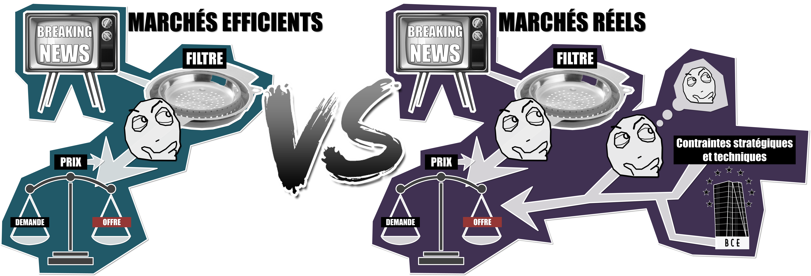
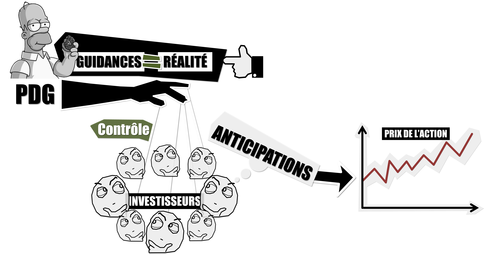
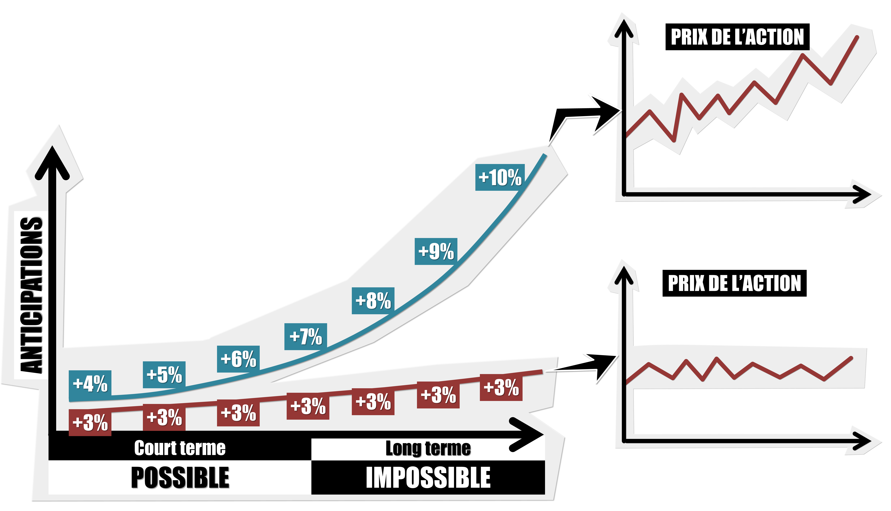
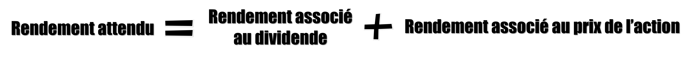
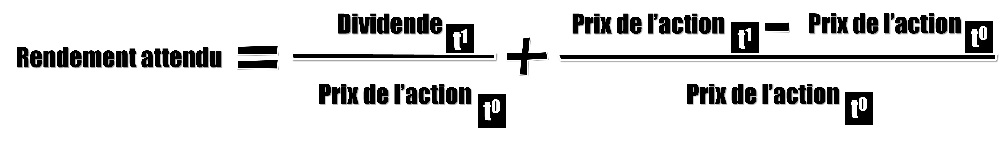
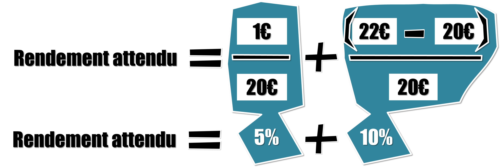

# SPOILERS !!! Episode 27 - Le réel objectif des entreprises SPOILER !!!

## Récap de l'épisode

Le prix des actions, donc le prix des entreprises, est déterminé par la loi de l’offre et de la demande. Et offre et demande sont théoriquement influencées par les « anticipations » des investisseurs sur les performances futures de des entreprises. La théorie des marchés efficients dit que les investisseurs n’utilisent que des informations pertinentes pour former ces anticipations. Elle ne dit pas que les investisseurs prédisent l’avenir avec précision, elle dit que la manière la plus rationnelle d’essayer de prédire l’avenir c’est de mettre en place des marchés financiers où offre et demande se rencontrent librement. Le problème, c’est que cette théorie ne tient pas compte des nombreux autres facteurs qui influencent les décisions des investisseurs et qui n’ont rien à voir avec des anticipations sur la future création ou destruction de richesses par les entreprises. 
Ici on peut citer : le quantitative easing et la création monétaire d’une manière général, les contraintes stratégiques, techniques ou légales des gros investisseurs et les boucles de rétroaction liées au fait que les investisseurs, en plus d’anticiper comment une information va jouer le futur d’une entreprise, vont aussi chercher à anticiper comment les autres investisseurs vont réagir.

 	

La meilleure preuve que les marchés financiers ne sont pas efficients, ce sont les bulles spéculatives : la théorie dit que tous les prix sont toujours des anticipations rationnelles formées à partir d’informations pertinentes, donc que tous les prix sont toujours justes. Or, il est aujourd’hui parfaitement admis que les bulles spéculatives, des phénomènes qui déconnectent les prix de la réalité, existent belle et bien et sont nombreuses. Ce qui montre que la théorie des marchés efficients est au mieux trop simple, au pire, complètement fausse.

Donc puisque les marchés ne sont pas efficients alors le prix des actions est faux. Ou en tout il n’est pas le reflet des informations pertinentes disponibles. Pourtant, on demande aux dirigeants de maximiser ce prix et, depuis l’article de 1976, on les incite à le faire, en les rémunérant de plus en plus avec des actions. Conclusion : les dirigeants ont tout intérêt à se focaliser sur des marchés financiers biaisés, manipulables, plutôt que de s’intéresser uniquement à la réalité du fonctionnement de leur entreprise.

Pire, afin de garder un contrôle maximal sur le cours de bourse via les fameuses « guidances », les dirigeants sont incités à ne jamais décevoir des marchés. Cela peut se traduire par la non-réalisation de tout projet dont le rendement serait supérieur ou inférieur à ce qui a été promis, donc à une forme d’immobilisme. Mais cela incite également les dirigeants à la fraude, à la dissimulation d’information et à la manipulation comptable afin d’augmenter ou de diminuer les résultats à volonté. Il n’est absolument pas question ici de dire que toutes les entreprises dissimulent des informations mais simplement de montrer comment l’objectif de maximisation du prix de l’action peut se retourner contre les entreprise et donc, contre les actionnaires.

Sans compter que cet objectif est contraint par l’horizon d’investissement de l’actionnaire majoritaire. Si celui-ci veut empocher le pactole d’ici 2 ans, alors l’entreprise doit se plier à cette volonté sans tenir compte du sort des autres actionnaires, présents ou futurs. 

Autre problème, l’augmentation perpétuelle du prix de l’action nécessite une augmentation perpétuelle du potentiel de croissance de l’entreprise. Autrement dit, il ne s’agit pas de croitre chaque année, il s’agit de croitre plus que prévu chaque année. Il faut que la croissance s’accélère pour que le prix de l’action augmente. Ce genre de tendance est intenable sur le long terme et les dirigeants en sont conscients. L’impossibilité de leur tâche les pousse à se concentrer sur le court terme, à maximiser le prix de l’action tant qu’ils le peuvent et à démissionner au sommet de la vague sans se soucier des conséquences.

 	
Pour conclure, les entreprises sont des entités extrêmement importantes qui sont au cœur de nos sociétés. Celles-ci interagissent avec leurs clients, leurs employés et leurs actionnaires. La théorie économique dominante les pousse à s’intéresser davantage à leurs actionnaires mais rien ne prouve qu’elles ne devraient pas plutôt se focaliser sur leurs clients ou même leurs employés. De plus, l’indicateur principal qui permet aux dirigeants de se focaliser sur les actionnaires, le prix de l’action, est complètement biaisé par des marchés inefficients. Également, maximiser la valeur de l’actionnaire devrait se faire en tenant compte de tous les actionnaires, présents et futurs, et ceux quels que soient leurs horizons d’investissement ou leurs parts dans l’entreprise. 

Face à toutes ces contradictions, il est grand temps de repenser le véritable objectif des entreprises et de fournir des indicateurs clairs pour vérifier qu’ils sont atteints.

## Le problème du « coût des capitaux propres » (« cost of equity ») ##

L’entreprise A décide de se lancer en bourse. L’offre se fait à 20€ l’action pour une quantité totale de 1 million d’actions. L’entreprise A récupère donc un financement de : 20€ * 1 000 000 = 20 millions d’€.

Du point de vue de l’investisseur qui se pose la question de savoir si l’achat des actions de l’entreprise A vaut la peine, la question essentielle est la suivante : quel est le rendement que j’espère retirer de mon investissement ? En effet, il existe des risques non négligeables : la valeur de l’action pourrait chuter, l’entreprise pourrait faire faillite. La perception du risque de la part de l’investisseur va déterminer le rendement qu’il va exiger de l’entreprise. Plus l’entreprise semble risquée, plus les actionnaires vont lui demander un rendement important. 

On peut alors écrire l’équation suivante :

Ou

Un petit exemple s’impose : Si l’investisseur Z achète une action de l’entreprise A pour 20€ et qu’il considère que le risque qu’il encourt correspond à un rendement de 15% (il n’y a aucune formule ni méthode pour tomber sur ce chiffre de 15%, chaque investisseur est libre de le choisir comme il l’entend), alors Z s’attends à ce que le fait de posséder cette action lui permette de générer un rendement de 15% par an. Autrement dit, Z veux pouvoir gagner au moins : 20€ * 15% = 3€ d’ici la fin de l’année. Du point de vue de l’entreprise, ce rendement attendu par les actionnaires est un coût que l’on appelle : « coût des capitaux propres » ou « cost of equity ».

Il y a deux manières de satisfaire les attentes des actionnaires. Soit le prix de l’action doit augmenter de 3€, soit l’entreprise doit verser un dividende de 3€ par action. Soit une combinaison des deux. Admettons que l’entreprise A verse un dividende de 1€ par action et que le prix de l’action soit passé à 22€. En reprenant l’équation de tout à l’heure on obtient :

# Alors quel est le problème ? #

Il faut bien garder en tête que l’entreprise A n’a été financée que à hauteur de 20€ par action au moment de son introduction en bourse. L’évolution du prix de l’action à partir de cette IPO (Inital Public Offering) n’a plus rien à voir avec le financement de l’entreprise. Autrement dit, si Z décide de vendre son action à Y pour 22€, il s’agit d’une transaction isolée entre Z et Y. Mais que ce passe-t-il si Y possède les mêmes attentes que Z ?
Lui aussi, veut voir son investissement lui rapporter 15% soit : 22€ * 15% = 3.30€

Mais puisque l’entreprise n’a été financée qu’à hauteur de 20€ par action, alors le rendement réel qu’elle doit fournir n’est pas de 15% mais bien de 16.5% (20€ * 16.5% = 3.30€) !

Et le problème ne va faire qu’empirer. Quand Y va vendre son action à X pour mettons 30€, X va s’attendre à un rendement de 15% soit : 30€ * 15% = 4.50€. Donc de son point de vue, l’entreprise devra fournir un rendement de 22.5% (20€ * 22.5% = 4.50€).

Une autre façon de comprendre le problème c’est d’associer le rendement attendu par les actionnaires et donc la production de richesse de l’entreprise, au financement effectivement perçu par cette dernière. En effet, si l’entreprise a été financée à hauteur de 20€, alors elle n’a pu s’équiper qu’à hauteur de 20€. Les machines qui sont à sa disposition pour créer de la richesse ont couté 20€. Ainsi, alors que les actionnaires demandent un rendement associé au prix actuel de l’action, disons 30€, l’entreprise ne dispose que d’un équipement dont la valeur est de 20€.

Si la prise de valeur de l’action était justifiée par une augmentation réelle des résultats financiers, alors il n’y aurait pas de problème. En effet, de plus gros bénéfices permettraient à l’entreprise d’améliorer son équipement et de réaliser des investissements. Mais puisque le prix de l’action repose sur des anticipations de l’avenir qui en plus, ne sont pas nécessairement rationnelles (#MarchésNonEfficients), alors celui-ci peut se retrouver complètement décorrélé des résultats réels de l’entreprise. La seule manière pour les dirigeants de satisfaire les rendements irréalisables des actionnaires devient alors de faire augmenter le prix de l’action. Car sans financement supplémentaires, jamais l’entreprise ne pourra dégager des bénéfices suffisants. Ici encore, les dirigeants se retrouvent forcer de concentrer leur attention sur le jeu des marchés, le jeu des anticipations, plutôt que sur celui de la production réelle de richesse.

