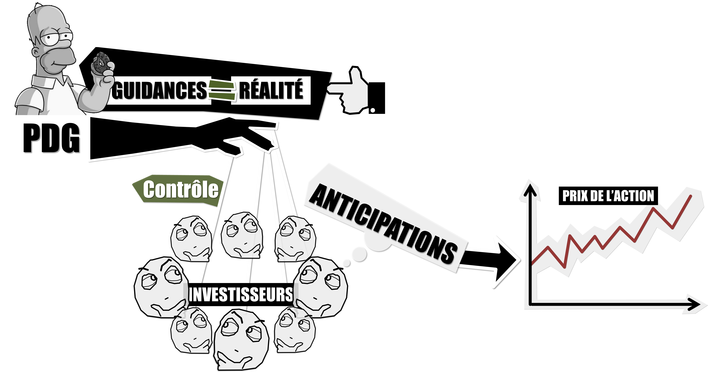

# SPOILERS !!! Episode 27 - Le réel objectif des entreprises SPOILER !!!

## Récap de l'épisode

Le prix des actions, donc le prix des entreprises, est déterminé par la loi de l’offre et de la demande. Et offre et demande sont théoriquement influencées par les « anticipations » des investisseurs sur les performances futures de des entreprises. La théorie des marchés efficients dit que les investisseurs n’utilisent que des informations pertinentes pour former ces anticipations. Elle ne dit pas que les investisseurs prédisent l’avenir avec précision, elle dit que la manière la plus rationnelle d’essayer de prédire l’avenir c’est de mettre en place des marchés financiers où offre et demande se rencontrent librement. Le problème, c’est que cette théorie ne tient pas compte des nombreux autres facteurs qui influencent les décisions des investisseurs et qui n’ont rien à voir avec des anticipations sur la future création ou destruction de richesses par les entreprises. 
Ici on peut citer : le quantitative easing et la création monétaire d’une manière général, les contraintes stratégiques, techniques ou légales des gros investisseurs et les boucles de rétroaction liées au fait que les investisseurs, en plus d’anticiper comment une information va jouer le futur d’une entreprise, vont aussi chercher à anticiper comment les autres investisseurs vont réagir.

 	

La meilleure preuve que les marchés financiers ne sont pas efficients, ce sont les bulles spéculatives : la théorie dit que tous les prix sont toujours des anticipations rationnelles formées à partir d’informations pertinentes, donc que tous les prix sont toujours justes. Or, il est aujourd’hui parfaitement admis que les bulles spéculatives, des phénomènes qui déconnectent les prix de la réalité, existent belle et bien et sont nombreuses. Ce qui montre que la théorie des marchés efficients est au mieux trop simple, au pire, complètement fausse.

Donc puisque les marchés ne sont pas efficients alors le prix des actions est faux. Ou en tout il n’est pas le reflet des informations pertinentes disponibles. Pourtant, on demande aux dirigeants de maximiser ce prix et, depuis l’article de 1976, on les incite à le faire, en les rémunérant de plus en plus avec des actions. Conclusion : les dirigeants ont tout intérêt à se focaliser sur des marchés financiers biaisés, manipulables, plutôt que de s’intéresser uniquement à la réalité du fonctionnement de leur entreprise.

Pire, afin de garder un contrôle maximal sur le cours de bourse via les fameuses « guidances », les dirigeants sont incités à ne jamais décevoir des marchés. Cela peut se traduire par la non-réalisation de tout projet dont le rendement serait supérieur ou inférieur à ce qui a été promis, donc à une forme d’immobilisme. Mais cela incite également les dirigeants à la fraude, à la dissimulation d’information et à la manipulation comptable afin d’augmenter ou de diminuer les résultats à volonté. Il n’est absolument pas question ici de dire que toutes les entreprises dissimulent des informations mais simplement de montrer comment l’objectif de maximisation du prix de l’action peut se retourner contre les entreprise et donc, contre les actionnaires.

Sans compter que cet objectif est contraint par l’horizon d’investissement de l’actionnaire majoritaire. Si celui-ci veut empocher le pactole d’ici 2 ans, alors l’entreprise doit se plier à cette volonté sans tenir compte du sort des autres actionnaires, présents ou futurs. 

Autre problème, l’augmentation perpétuelle du prix de l’action nécessite une augmentation perpétuelle du potentiel de croissance de l’entreprise. Autrement dit, il ne s’agit pas de croitre chaque année, il s’agit de croitre plus que prévu chaque année. Il faut que la croissance s’accélère pour que le prix de l’action augmente. Ce genre de tendance est intenable sur le long terme et les dirigeants en sont conscients. L’impossibilité de leur tâche les pousse à se concentrer sur le court terme, à maximiser le prix de l’action tant qu’ils le peuvent et à démissionner au sommet de la vague sans se soucier des conséquences.

 	
Pour conclure, les entreprises sont des entités extrêmement importantes qui sont au cœur de nos sociétés. Celles-ci interagissent avec leurs clients, leurs employés et leurs actionnaires. La théorie économique dominante les pousse à s’intéresser davantage à leurs actionnaires mais rien ne prouve qu’elles ne devraient pas plutôt se focaliser sur leurs clients ou même leurs employés. De plus, l’indicateur principal qui permet aux dirigeants de se focaliser sur les actionnaires, le prix de l’action, est complètement biaisé par des marchés inefficients. Également, maximiser la valeur de l’actionnaire devrait se faire en tenant compte de tous les actionnaires, présents et futurs, et ceux quels que soient leurs horizons d’investissement ou leurs parts dans l’entreprise. 

Face à toutes ces contradictions, il est grand temps de repenser le véritable objectif des entreprises et de fournir des indicateurs clairs pour vérifier qu’ils sont atteints.

