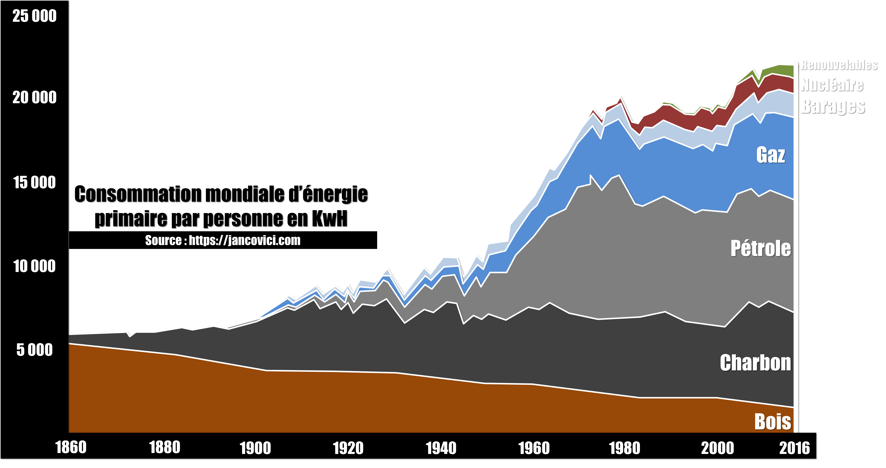
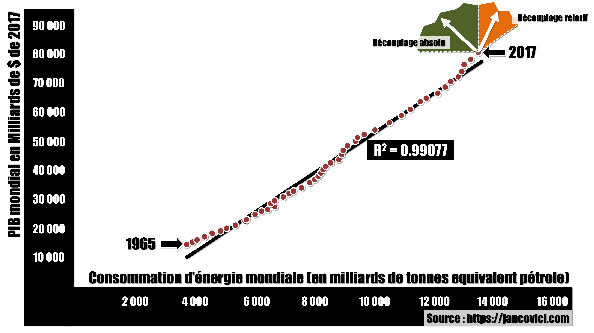
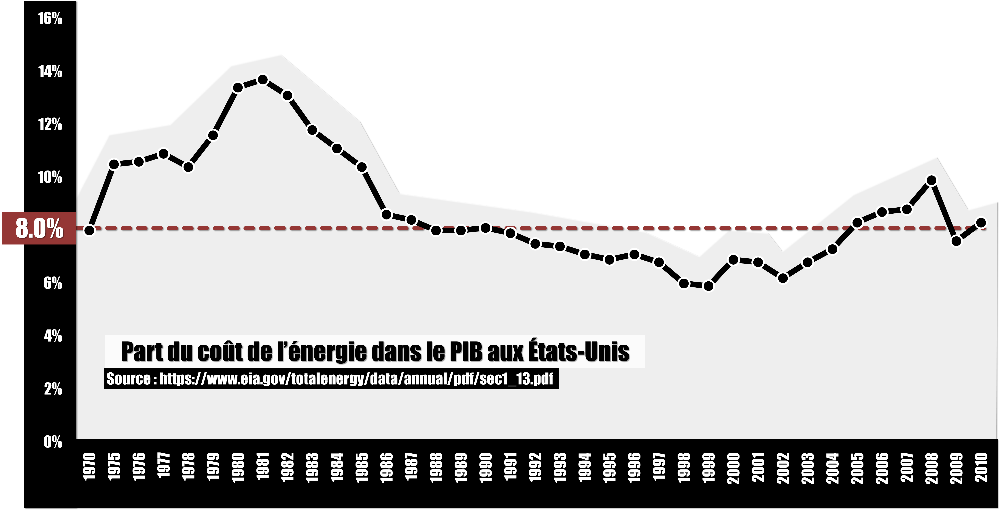
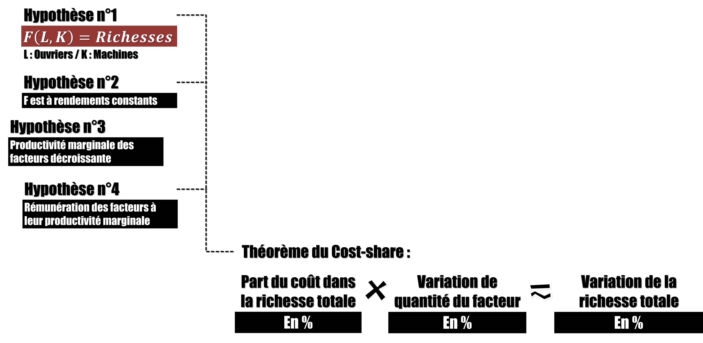
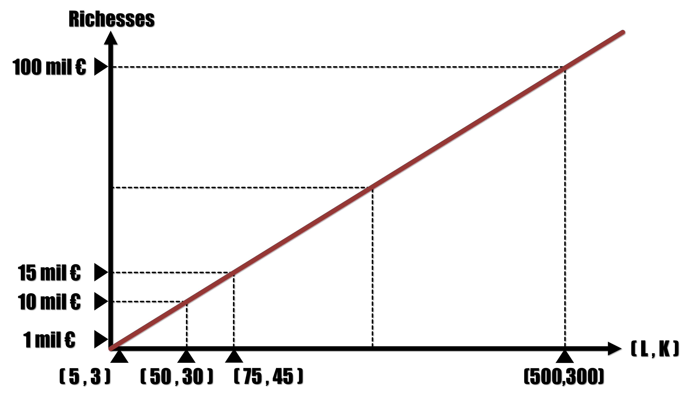

# SPOILER ALERT !!! Episode 28 - Croissance & énergie : l'erreur des économistes ?

## Récap de l'épisode

D’abord quelques constats : 80% de l’énergie que nous utilisons vient du charbon, du pétrole et du gaz qui tous, émettent du CO2 quand on les brûle ce qui provoque un changement climatique qu’on voudrait éviter.

**Source :** jancovici.com **What is energy, actually?** [Lien](https://jancovici.com/en/energy-transition/energy-and-us/what-is-energy-actually/)

S’en passer tout en continuant d’utiliser la même quantité d’énergie nécessite une révolution industrielle ! Si tant est que ce soit possible et techniquement, c’est pas du tout gagné, il faut reconstruire toutes nos machines, voitures, bateaux, avions, tracteurs, camions pour qu’ils fonctionnent à l’électricité. Il faut fabriquer des quantités titanesques d’éoliennes, de panneaux solaires et de batteries ce qui nécessite d’extraire des quantités tout aussi énorme de métaux rares de la croute terrestre. Or, non seulement on ne sait pas si de telles ressources existent mais en plus, l’industrie minière est la deuxième industrie la plus polluante au monde après celle du recyclage des batteries au plomb. Sans compter que, le chantier de la transition énergétique va nécessiter l’utilisation de toutes les machines dont on dispose actuellement et qui fonctionnent en brulant des ressources fossiles. Donc cette transition va émettre beaucoup de CO2. La conclusion, c’est qu’il y a de grandes chances que le sauvetage de la planète passe par une réduction de notre consommation d’énergie. Or, sur ce graphique, on voit bien qu’il existe une corrélation évidente et linéaire entre croissance économique et consommation d’énergie.

**Source :** jancovici.com **What is energy, actually?** [Lien](https://jancovici.com/en/energy-transition/energy-and-us/what-is-energy-actually/)

D’où la question : une baisse de la consommation d’énergie implique-t-elle une baisse de la croissance économique voire même une récession ? La question est extrêmement importante car nos sociétés ne sont pas du tout faites pour décroître. Quand le PIB diminue, on parle de crise économique. 

Selon beaucoup d’économistes influents, le problème d’une éventuelle récession liée à une baisse de la consommation d’énergie n’existe pas. La raison repose sur l’observation suivante : si l’énergie était si importante que ça dans la croissance, alors son prix serait beaucoup plus élevé ! En effet, la part des dépenses associées à la consommation d’énergie primaire dans la PIB est très faible, de l’ordre de 10% tout au plus.

**Source :** Agence Internationale de l'Energie [Lien](https://www.eia.gov/totalenergy/data/annual/pdf/sec1_13.pdf)

Ainsi, une baisse de la consommation d’énergie de 10% entrainerait une baisse du PIB de seulement 1%. C’est ce qu’on appelle le théorème du Cost-Share. Mais d’où vient ce raisonnement qui dit que le prix de l’énergie correspond à sa contribution à la formation du PIB ?

**Remarque :** l'hypothèse n°3 (productivité marginale des facteurs décroissante) est supposée dans la théorie de la fonction de production mais n'est pas nécessaire pour que le Cost-Share s'applique.

**Preuve :** Université de Toulouse [Lien](http://www.math.univ-toulouse.fr/~schindle/articles/the_cost_share_theorem.pdf)

Il s’agit d’un raisonnement théorique et mathématique. S’il existe une fonction de production qui permet, si on lui donne les quantités de tous les types d’ingrédients, de prédire quel sera le PIB. Si cette fonction est à rendement d’échelle constants, càd que si on multiplie toutes les quantités d’ingrédients par une même constante x, alors le PIB est aussi multiplié par x.

**Remarque :** L et K correspondent à des quantités de "travail" (heures de travail ou nombre de travailleurs) et de "capital" (addition de la valeur de tout ce qui n'est pas du travail)

Et si on considère que la rémunération ou le coût, c’est pareil, de chaque type d’ingrédient correspond à sa productivité marginale, alors, le théorème du Cost-share est vérifié.

Le problème de ce raisonnement, c’est que les hypothèses ne sont pas très solides. Robert Solow a effectivement montré que le PIB américain pouvait être décrit par une fonction de production à rendement d’échelle constants. Une Cobb-Douglas. 

**Remarque 1 :** L et K sont des quantités

**Remarque 2 :** Une critique du modèle de Robert Solow par Bernard Guerrien : **Fonction de production agrégée et idéologie** [Lien](http://bernardguerrien.com/wp-content/uploads/2017/07/FoncProduction_et_Ideologie.pdf)

Mais, pour y arriver, il lui a fallu additionner des valeurs de capital en considérant qu’il s’agissait de quantités de capital. Or, tous les économistes ne sont pas d’accord là-dessus, c’est la controverse des deux Cambridge. Solow a également été attaqué sur les maths de son raisonnement. Ainsi, les hypothèses d’existence d’une fonction de production décrivant l’économie dans son ensemble et de sa forme particulière, à rendements d’échelle constants, sont très incertaines.

Cela dit, l’hypothèse la moins robuste reste celle de la rémunération des facteurs de production à hauteur de leur productivité marginale. Quelle que soit la manière dont on attaque le problème, la démonstration est bancale. Si on fixe les quantités, l’entreprise doit utiliser toutes les machines et tous les ouvriers, alors rien ne justifie une rémunération des facteurs à hauteur de leur productivité marginale. On pourrait imaginer la répartition qu’on veut du moment que toutes les richesses sont bien distribuées. Certains évoquent alors la théorie de la firme, démonstration de microéconomie qui montre que les entreprises sont obligées de rémunérer les facteurs à hauteur de leur productivité marginale. Le problème c’est que cette démonstration fait l’hypothèse d’une fonction de production à rendement d’échelle décroissants ce qui ne colle pas avec nos hypothèses. Vient alors l’idée de fixer les rémunérations et de laisser les quantités fluctuer. Les mathématiques fonctionnent alors très bien et l’entreprise doit effectivement choisir les bonnes quantités pour que la rémunération des facteurs, fixée à l’avance, corresponde bien à leur productivité marginale. Le problème c’est qu’on suppose alors que les entreprises connaissent la fonction de production, qu’elles y ont accès, qu’elles savent l’utiliser. Or l’objectif, c’est justement de montrer qu’on n’a pas besoin de connaitre la fonction production pour pouvoir faire des prédictions. D’où le paradoxe : grâce au cost-share, sans connaître la fonction de production, on peut faire des prédictions sur l’impact d’une variation de quantité d’ingrédient sur le PIB. Sauf qu’il faut supposer que les entreprises connaissent la fonction de production pour que le cost-share s’applique… Sans compter qu’il faut aussi supposer que la rémunération des actionnaires est fixe, contractuelle, connue à l’avance par les entreprises… Ce qui est complètement irréaliste.

**Remarque :** une autre manière de présenter les choses [Lien](http://www.autisme-economie.org/article178.html)

Pour finir d’enfoncer le clou, le modèle ne résiste pas à d’éventuelles contraintes techniques, géologiques, politiques, légales, éthiques ou sociales qui empêcheraient les entreprises d’utiliser les bonnes combinaisons d’ingrédients, d’utiliser la recette optimale. Or, les recherches empiriques sur l’existence de ces contraintes sont inexistantes.

**Remarque :** une vidéo de Gaël Giraud expliquant le problème des contraintes [Lien](https://youtu.be/vW7WywnOxas)

Pour toutes ses raisons… Le moins que l’on puisse dire, c’est que le raisonnement des économistes est à prendre avec des pincettes…

Mais même sans cela, y a-t-il un quelconque sens à faire des prédictions toutes choses égales par ailleurs en économie ? Si rien ne se passe jamais toutes choses égales par ailleurs alors quelle est l’intérêt d’une telle prédiction ? Se demander comment varierait le PIB si on avait 10% d’énergie en moins et QUE 10% d’énergie en moins, n’a pas de sens. On peut tout à fait supposer que les machines continueront de tourner sans énergie ou que les travailleurs continueront de travailler sans nourriture, mais le caractère prédictif de telles hypothèses est nul. Sans nourriture pour les travailleurs, pas de production. Sans énergie et sans matières premières pour les machines, pas de production non plus.

Malheureusement, les économistes sont majoritairement convaincus par leur méthode et par leur modèle si bien que l’avertissement de certains économistes, physiciens et ingénieurs passe inaperçu. Certes, le progrès technique permettra peut-être de fabriquer des machines plus efficaces, càd qui consomment moins, mais il y a des contraintes techniques et géologiques à prendre en compte. Le progrès technique ne peut pas simplement se définir comme une variable qu’on peut ajuster à souhait pour faire fonctionner les formules ! Celui-ci est nécessairement contraint par les lois de la physique. Tout n’est pas possible. Bref, les modèles économiques ne peuvent pas se contenter de raisonnements mathématiques théoriques avec pour seule donnée des prix et des quantités. L’économie doit aussi prendre en compte les lois de la physique, les contraintes géologiques, climatiques et environnementales ce qui pour le moment est loin d’être le cas.

## Principales sources : ##

**Source 1 :** La théorie de la répartition néoclassique [Lien](http://www.autisme-economie.org/article178.html)

**Source 2 :** Fonction de production agrégée et idéologie [Lien](http://bernardguerrien.com/wp-content/uploads/2017/07/FoncProduction_et_Ideologie.pdf)

**Source 3 :** Le lien entre le PIB et l'énergie [Vidéo](https://youtu.be/vW7WywnOxas)
