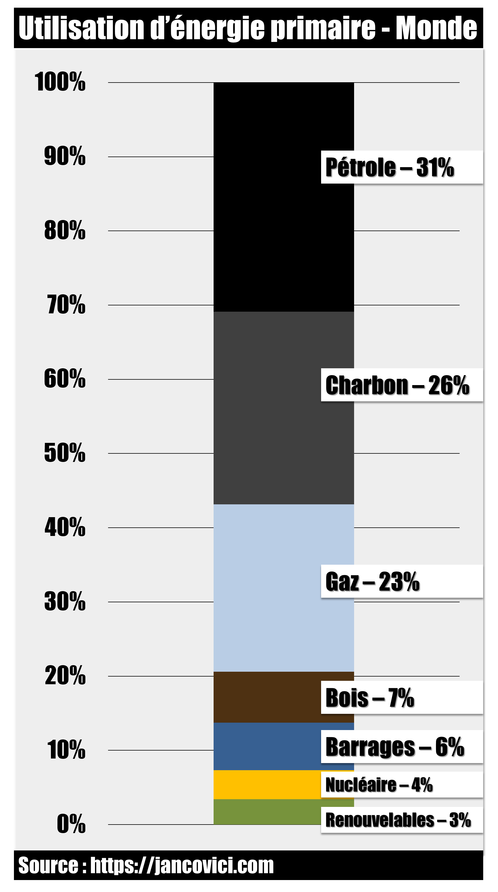
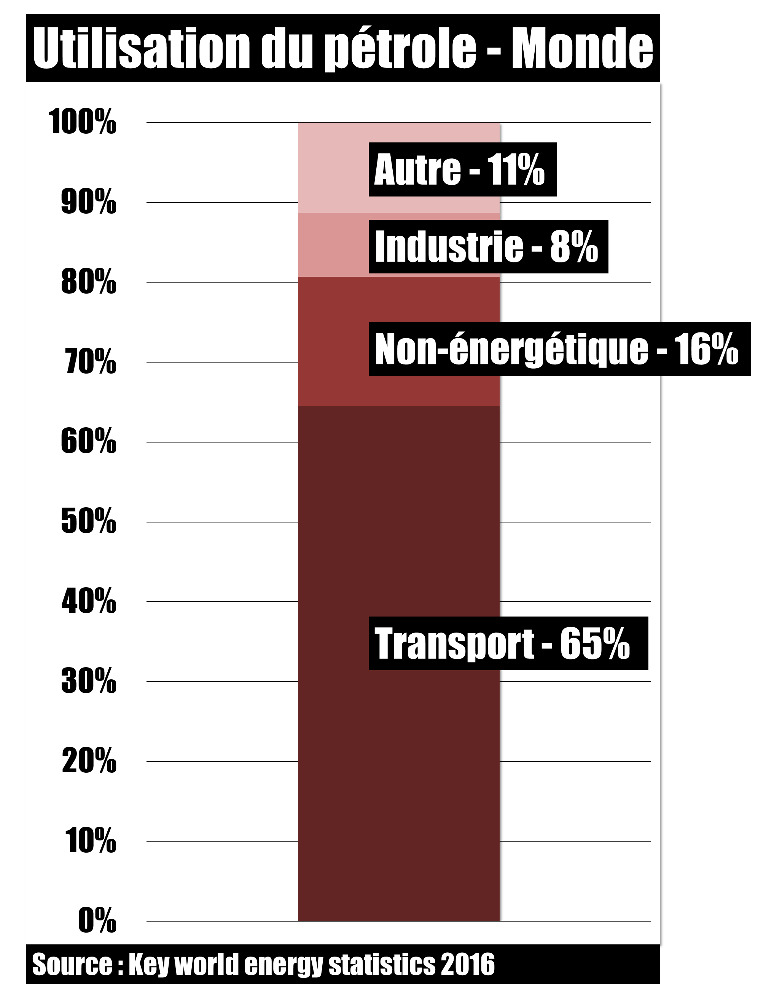
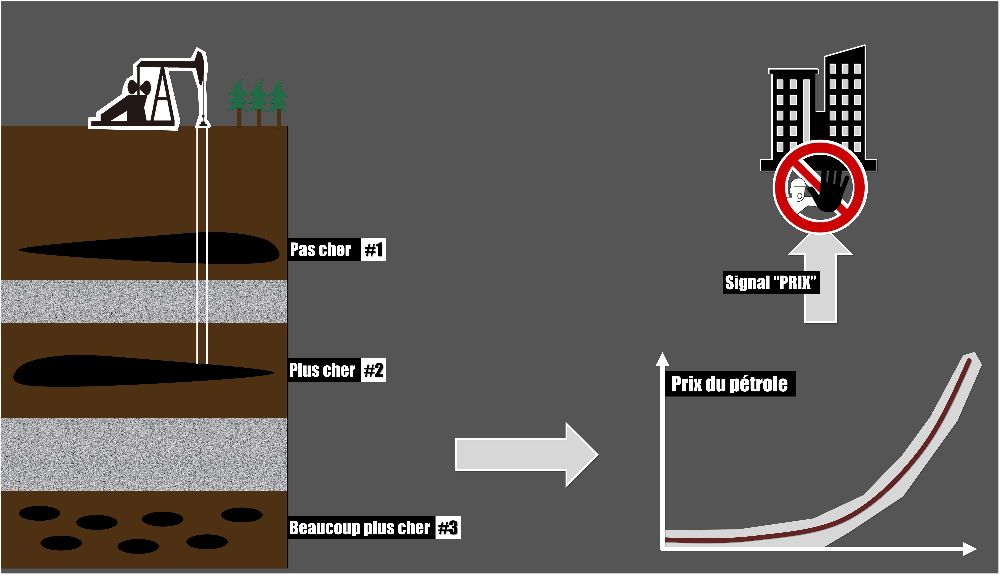
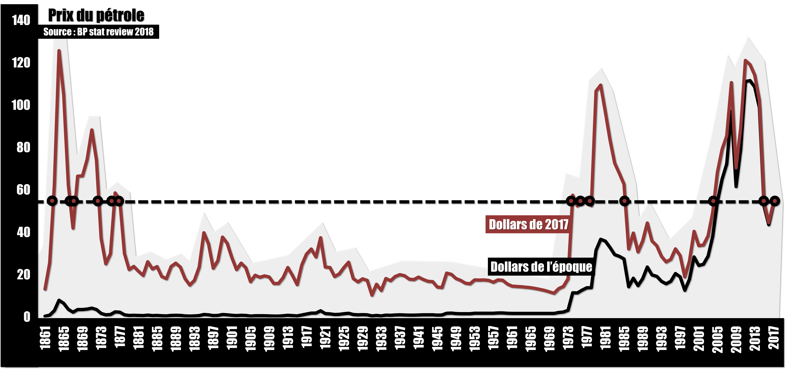

# Episode 29-1 : Le prix du baril ne peut que grimper n'est-ce pas ?

## Récap de l'épisode

Commençons par quelques chiffres histoire de bien comprendre de quoi on parle. On a besoin d’énergie pour que nos machines fonctionnent et pour chauffer des trucs. Pour y arriver, on peut grosso modo utiliser 8 sources d’énergie primaire. Si on regarde comment elles se répartissent au niveau mondial, on se rend compte que le pétrole est le plus gros contributeur avec 31%, suivi du charbon 26% et du gaz 22%. 

**Source : ** jancovici.com **What is energy, actually?** [Lien](https://jancovici.com/en/energy-transition/energy-and-us/what-is-energy-actually/)

Toujours au niveau mondial, si on regarde les différents usages du pétrole on voit que la plus grande partie, 65%, sert au transport. Mais on a aussi 8% qui servent aux activités industrielles, essentiellement pour chauffer des matériaux ou pour produire de l’électricité. Et puis il y a 16%, la partie non-énergétique, qui correspond à la pétrochimie : plastiques divers, tissus synthétiques, emballage alimentaires, huiles de moteur, solvant, engrais, bitume etc. Enfin les 11% restants correspondent aux usages du fioul lourd. On s’en sert essentiellement comme système de chauffage pour les bâtiments et aussi comme carburant pour les gros navires de commerce ou pour les chars d’assaut.

**Source :** Key World Energy Statistics 2016 [Lien](https://www.oecd-ilibrary.org/energy/key-world-energy-statistics-2016_key_energ_stat-2016-en)

Les macro-économistes utilisent un modèle développé par Harold Hotelling en 1931 pour analyser le problème de l’épuisement des ressources non renouvelables comme le pétrole. D’après ce modèle, le prix du pétrole devrait croitre de manière exponentielle car celui-ci doit tenir compte d’une ressource toujours plus rare qui coute toujours plus cher à extraire et doit être multiplié par un taux d’intérêt toujours positif. Ainsi, la hausse du prix du pétrole est inévitable et les entreprises qui en dépendent vont naturellement et automatiquement se détourner de cette ressource. Plus le pétrole sera cher, moins les entreprises voudront l’utiliser et chercheront des alternatives pour rester compétitives. La conclusion n’est pas aussi nette en réalité mais en gros, les macro-économistes n’ont pas vraiment l’impression que la finitude de certaines ressources soit un problème. Le marché va transmettre l’information de cette finitude par le biais des prix… Les entreprises seront alors encouragées à innover, à utiliser les ressources de manière plus efficaces ou à leur trouver des substituts.

**Source :** Wikipedia : Rente d'Hotelling [Lien](https://fr.wikipedia.org/wiki/Rente_d%27Hotelling)

Cependant, le modèle d’Hotelling ne fait pas l’unanimité. D’abord quand on regarde le prix en dollar constants du pétrole depuis 1860, force est de constater qu’on ne voit pas de croissance exponentielle qui traduirait d’une ressource toujours chère à extraire. 

**Source :** BP Statistical Review 2018 [Lien](https://www.bp.com/en/global/corporate/energy-economics/statistical-review-of-world-energy/downloads.html)

Alors d’où vient l’erreur ? Le raisonnement d’Hotelling suppose une augmentation exponentielle du prix du baril. Or d’après le modèle de Black & Scholes, les marchés financiers ne laisseront pas une telle tendance se matérialiser. Si les financiers pensaient que le scénario d’Hotelling était correct, alors le prix du pétrole serait déjà très élevé et on ne verrait de toute façon pas apparaître une belle tendance exponentielle. Cela vient du fait que si une  tendance, une régularité, permettant d’anticiper l’avenir se matérialisait, il serait possible de gagner de l’argent sans prendre de risque, au dépend d’un pigeon qui n’aurait pas repéré cette opportunité. Or, sur des marchés financiers toujours plus professionnels… où les financiers dépensent des milliards pour repérer les régularités encore inexploitées, on peut être sûr qu’une simple tendance exponentielle sur le prix du pétrole n’existe plus depuis longtemps.

**Source :** Nicolas BOULEAU - Le mensonge de la fiance [Lien](https://www.amazon.fr/mensonge-finance-math%C3%A9matiques-signal-prix-plan%C3%A8te/dp/2708245554)

Pourtant, le pétrole est bien une ressource de plus en plus rare, une ressource qui s’épuise. Nos modes de vie en dépendent et un jour ou l’autre, on atteindra un pic d’extraction. Il est également plus que probable de supposer que le progrès des méthodes d’extraction ne permettra pas de toujours l’obtention d’un pétrole peu coûteux. Les financiers sont au courant de tout ça et pourtant, le prix du pétrole n’est pas très élevé. Pourquoi ?

D’abord parce que l’avenir est incertain par définition. Les scénarios d’une baisse de la demande de pétrole et donc, d’une baisse de son prix sont multiples : transition écologique, développement des énergies renouvelables et abandon du pétrole avant le pic. Maintien d’un pétrole peu cher grâce au progrès technique pendant encore plusieurs décennies. Taxes sur les émissions de CO2 qui pousseraient les entreprises et les particuliers à diminuer leurs usages de produits issus de l’industrie pétrolière. Mais au-delà de ça, il faut bien comprendre que les marchés financiers sont plutôt courts termites. Le prix du pétrole n’est jamais qu’un signal qui matérialise les avis divergents d’une communauté d’investisseurs qui cherchent à satisfaire leurs chefs de service d’ici la fin de l’année. Il y a toujours une logique derrière un prix mais celle-ci peut tout à fait être erronée. Peu importe les anticipations, peu importe leurs cohérences avec les réalités du monde, ce qui compte c’est la rentabilité.

En réalité, le meilleur modèle dont on dispose pour décrire le fonctionnement des marchés nous dit que les trajectoires de prix qui en sont issus sont simplement aléatoires.

Tout ça pour dire que le prix du pétrole ne va pas augmenter petit à petit. La question de l’abandon de cette ressource, que ce soit pour des raisons de pollution ou de réserves, est un sujet extrêmement délicat et complexe. L’optimisme du « laissez faire le marché, il résoudra le problème tout seul en envoyant un signal prix aux entreprises » est loin d’être fondé. Les entreprises ne verront pas le prix du pétrole lentement augmenter. Le jour où le pic arrivera, le jour où le progrès technique atteindra ses limites, si l’économie n’a pas trouvé d’alternative, les entreprises seront simplement mises devant un fait accompli mais elles n’auront obtenu aucun avertissement de la part du marché.

## Remerciements

Merci à Rodolphe Meyer ([le réveilleur](https://www.youtube.com/channel/UC1EacOJoqsKaYxaDomTCTEQ)) pour sa première relecture du script.

Merci également à [Adrien Nguyen](https://sites.google.com/site/anhhomepage/) pour ses explications précieuses et ses nombreux conseils de lecture.

