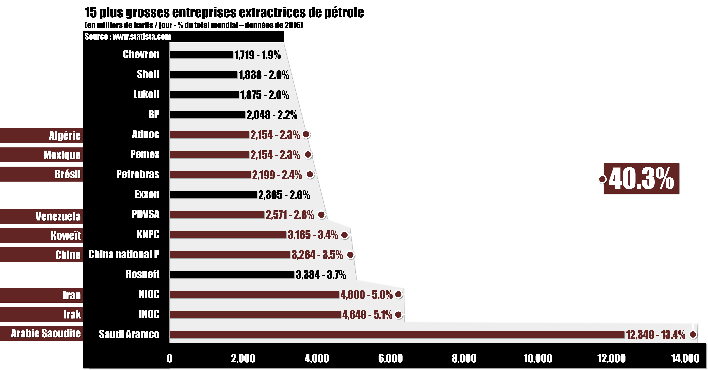
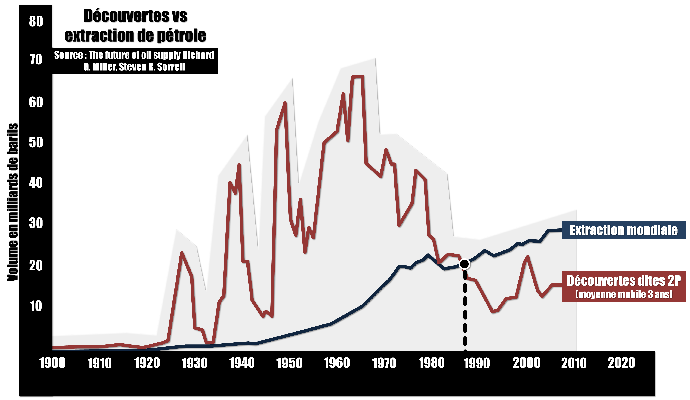
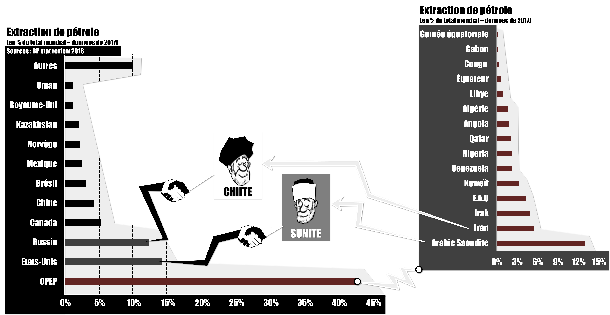
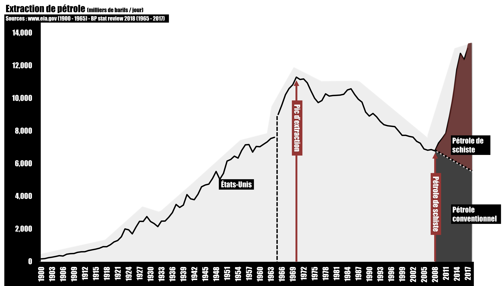

# Episode 29-2 : Parier sur le pétrole : mission impossible.

## Sources :

Données macroéconomiques : [FRED](https://fred.stlouisfed.org/)

[Le prix du Brent](https://fred.stlouisfed.org/series/DCOILBRENTEU)

[Les différents prix du pétrole](https://oilprice.com/oil-price-charts#prices)

**Statistiques sur l'énergie :**

[Agence International de l'énergie](https://www.eia.gov/)

[Our World in Data](https://ourworldindata.org/)

[BP Stat review](https://www.bp.com/en/global/corporate/energy-economics/statistical-review-of-world-energy.html)

**Livre :** 

Nicolas Bouleau - [Le mensonge de la finance](https://www.amazon.fr/mensonge-finance-math%C3%A9matiques-signal-prix-plan%C3%A8te/dp/2708245554)

## Les principaux graph

**Source :** Statistica [Lien](https://www.statista.com/statistics/280705/leading-oil-companies-worldwide-based-on-daily-oil-production-2012/)

**Source :** The future of oil supply Richard G. Miller, Steven R. Sorrell [Lien](https://royalsocietypublishing.org/doi/full/10.1098/rsta.2013.0179)

**Source :** BP Stat review 2018 [Lien](https://www.bp.com/en/global/corporate/energy-economics/statistical-review-of-world-energy.html)

**Source :** BP Stat review 2018 [Lien](https://www.bp.com/en/global/corporate/energy-economics/statistical-review-of-world-energy.html)

**Source :** EIA [Lien](https://www.eia.gov/dnav/pet/hist/LeafHandler.ashx?n=pet&s=mcrfpus2&f=a)

## Récap de l'épisode

Les financiers fixent le prix du pétrole en pariant sur la hausse ou la baisse du prix. Pour y arriver, ils essayent de prédire l’avenir de l’offre et de la demande de pétrole. Or, ces deux variables fluctuent en fonctions de nombreux paramètres extrêmement complexes.

D’abord, les flux de pétrole comptent beaucoup plus que les stocks, les débits des robinets sont plus importants que les réserves. On s’intéresse au nombre de baril par jour qu’un gisement est capable de fournir plutôt qu’au nombre de baril total qu’il pourra fournir tout au long de son exploitation. C’est pour ça que le prix du baril peut baisser alors que pourtant, le pétrole est bien une ressource de plus en plus rare.

Ensuite, il faut penser à tous les autres détails qui vont affecter l’offre réelle de pétrole : le débit des robinets va-t-il rester contant ? Quelqu’un peut-il décider de couper les vannes ? Comment le pétrole sera-t-il transporté jusqu’aux raffineries ? Ces capacités de transport sont-elles suffisantes ? Les capacités de raffinages sont-elles suffisantes ? Quel est le type de pétrole extrait ? Quels sont les projets de nouveaux robinets en cours et quand seront-ils terminés ? Tout en gardant à l’esprit que les gisements de pétrole appartiennent à des états qui jouent un jeu géopolitique, où la maximisation des bénéfices n’est pas la règle, que les principales entreprises extractrices sont nationales et que les données sur les réserves et les débits qu’elles contrôlent ne sont pas connus avec précision.

Maintenant pour un financier, après avoir tenu compte de toutes ces variables et répondu à toutes ces questions… Face à ce chiffre de l’offre future de pétrole qu’il vient d’obtenir et qui, à la vue des nombreux paramètres libres et incertains, peut être très différent de celui de son voisin, il lui faut encore déterminer le chiffre de la demande future de pétrole. Un chiffre tout aussi incertain, qui dépend du développement futur de l’activité économique. Et c’est seulement une fois l’offre et la demande future de pétrole déterminée, que le financier pourra parier et ainsi, participer à la formation du prix actuel du pétrole.

Toute cette complexité peut sembler insurmontable, et en fait elle l’est. Même les financiers qui font le même pari le font rarement pour les mêmes raisons. En outre, il y a un mécanisme de plus dont il faut tenir compte : le prix du pétrole dépend du niveau de la demande, mais la demande dépend aussi du prix. Et c'est la même chose pour l’offre. Prédire le prix futur du pétrole implique de prédire les futurs niveaux de l’offre et la demande, qui eux-mêmes, ne peuvent être établis sans avoir déjà anticipé le prix futur. Il y a ici une circularité qui finit par invalider tous les raisonnements et qui provoque une fluctuation du prix. Je parie à la hausse, le prix monte, donc l’économie ralentit, donc la demande de pétrole diminue tandis que l’offre accélère grâce aux profits et investissements des entreprises extractrices, donc le prix diminue… Conclusion : j’ai eu raison de parier à la hausse dans un premier temps mais j’ai intérêt à vite changer d’avis.

De juin 2014 à janvier 2016, le prix du baril de brent est passé de 114 à 27 dollars. On justifie cette baisse par une forte accélération de l’extraction de pétrole dit de schiste aux États-Unis. Un pétrole de moins bonne qualité que le pétrole conventionnel et très cher à aller chercher mais dont l’exploitation était devenue rentable grâce à un prix du baril très élevé entre 2011 et 2014. De janvier 2016 à octobre 2018, on justifie la hausse du prix du baril par un accord des pays de l’OPEP et de la Russie pour limiter leur production. Depuis octobre, pour le moment, on ne sait pas très bien justifier ce qui se passe. La réalité, c’est qu’on ne peut jamais vraiment savoir ce qui se passe ou ce qui s’est passé. On ne fait que chercher à rationnaliser des fluctuations dont les causes sont liées à des décisions prises par des financiers, eux-mêmes submergés d’informations et de scénarios contradictoires sur l’avenir. Il faut se rendre à l’évidence, on a déjà du mal à comprendre ce qui se passe sur les marchés financiers en général mais clairement pour le pétrole : c’est pire que tout.
