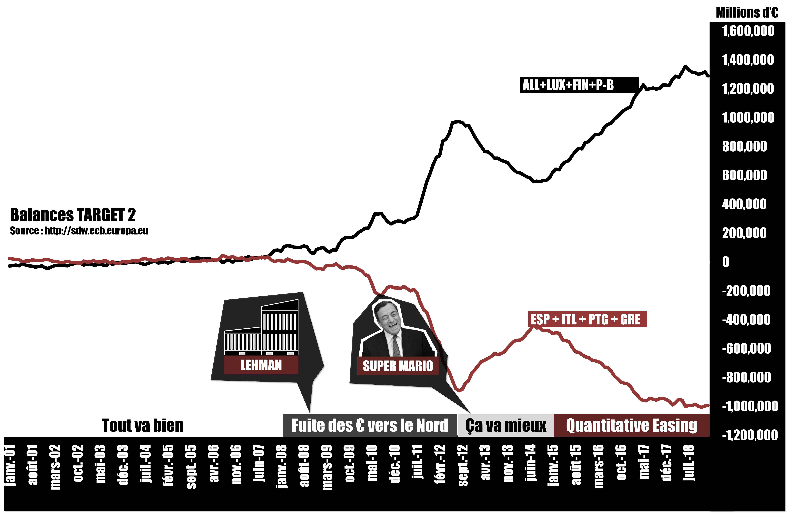

# SPOILER ALERT !!! Episode 30-1 : Le vrai faux problème TARGET2

## Les principaux Graphiques et schémas

Source : [Banque Centrale Européenne](http://sdw.ecb.europa.eu/browse.do?node=9691112)

Source : [Banque Centrale Européenne](http://sdw.ecb.europa.eu/browse.do?node=9691112)

Source : [Banque Centrale Européenne](https://www.ecb.europa.eu/mopo/implement/omt/html/index.en.html#pspp)

## Récap de l'épisode

Premièrement parce que les banques commerciales créent la monnaie par l’intermédiaire des prêts qu’elles octroient aux ménages et aux entreprises, la quantité de monnaie scripturale dans une zone monétaire correspond à la quantité de dette bancaire. Si cette zone est un pays, alors sa monnaie ne peut jamais le quitter même si ce dernier est en situation de déficit commercial. Cela est dû au fait que la monnaie n’a pas cours ailleurs que dans ce pays.

D’ailleurs, si jamais il y a un déficit commercial avec un pays dont le niveau de développement est similaire, alors celui-ci ne devrait pas durer. La raison en est simple : les entreprises du pays en excédent vont régulièrement acquérir et vendre la monnaie du pays en déficit, provoquant ainsi la perte de valeur de cette dernière et donc le renforcement de la compétitivité du pays en déficit à l’export. Ainsi, le rapport d’excédent commercial entre les deux pays devrait s’inverser.

Cela dit, au sein d’une zone monétaire, il n’est pas rare que de la monnaie créée dans une région pauvre soit transférée dans une autre région plus riche. Le déséquilibre « dette / quantité de monnaie » qui en résulte favorise le développement économique de la région qui a le plus de monnaie et au contraire ralenti le développement de celle qui en a le moins. Pour rééquilibrer la donne, les états ont à leurs dispositions différents impôts, taxes et transferts. Le problème, c’est que ce genre de déséquilibre ne peut pas être adressé par le très faible budget européen. Et de toute manière, l’idéologie ordolibérale, dans le cadre de la répartition de la monnaie, a tendance à préférer s’en remettre à une libre concurrence stricte, sans aucune intervention étatique, ainsi qu’à une libre circulation des capitaux. Les déséquilibres des balances T2 montrent à quel point le marché ne remplit pas correctement cette tâche de répartition de la monnaie à l’heure actuelle. En effet, les euros créés dans le SUD de la zone s’accumulent dans le NORD sans être réinvestis dans le SUD.

La balance T2 excédentaire de l’Allemagne de 884 milliards ne signifie en aucun cas que cette somme serait due aux ménages et entreprises allemandes. De la même manière, les balances fortement négatives de l’Italie et de l’Espagne n’indiquent aucunement que les ménages et entreprises de ces pays devraient rembourser quoi que ce soit à un pays membre de l’euro. Les balances T2 n’ont qu’une seule signification : les agents économiques des pays du SUD se sont endettés auprès de leurs banques, celles-ci ont créé de la monnaie, la monnaie s’est en allé dans les pays du NORD, principalement en Allemagne, et elle est toujours là-bas actuellement. Autrement dit, les entreprises et ménages allemands disposent d’une quantité de monnaie à leur disposition dont le montant, par rapport à la totalité des dettes du pays, est supérieur d’au moins 884 milliards. Encore une fois, personne ne doit rien aux allemands, les euros des balances T2 circulent déjà en Allemagne.

La raison technique de l’existence des balances T2 repose sur le fait que les euros centraux, qui servent de relai dans la circulation des euros scripturaux, sont spécifiques aux pays dans lesquels ils circulent. Autrement dit, un euro central doit porter le sceau du pays dans lequel il peut être utilisé. Ainsi, à chaque fois que des euros centraux passent de A à B, il y a destruction des euros centraux A, puis création de nouveaux euros centraux portant cette fois le sceau de B. Or, comptablement, la création monétaire nécessite toujours une dette. D’où les dettes T2 qui finalement, servent uniquement à assurer la libre circulation de la monnaie scripturale que nous utilisons chaque jour.
Cela dit, pour que les balances T2 augmentent fortement, il faut deux conditions :
D’abord le marché interbancaire doit être bloqué sans quoi les dettes T2, par le biais des flux de prêts dans un sens et de paiement dans l’autre, s’annulent. Ensuite, il faut que les flux monétaires entre les différents pays ne se compensent pas.

Avant 2008, les marchés interbancaires étant fonctionnels, il est impossible de lire quoi que ce soit dans les balances T2. En revanche à partir de 2008, parce que la faillite de Lehman Brothers provoque un blocage du marché interbancaire, les balances T2 deviennent des indicateurs qui nous montrent les déséquilibres de la répartition de la monnaie en zone euro.

On peut lire 3 phases différentes dans les mouvements des balances T2 :
De 2008 à 2012, fuite des capitaux investis dans les pays du SUD. On pense à un résidu d’excédent commercial du NORD jusque-là investi dans le SUD qui est rapatrié et un transfert d’une partie de l’épargne de résidents les plus aisés. De 2012 à 2015, un rééquilibrage probablement dû en partie au discours de Mario Draghi. A partir de 2015, l’impact du QE de la BCE. 

En effet, parce que cette mesure suppose une création de monnaie centrale depuis les différents pays membres qui sert ensuite à acheter des produits financiers détenus dans les états au sein desquels sont immatriculés les principales entreprises financières de la zone euro, on aboutit à augmentation des balances TARGET qui ne fait que signaler que l’Allemagne, le Luxembourg, la Finlande et la hollande sont les grands centres financiers européens.
Et d’ailleurs, le fait que les balances T2 n’aient que augmenté et pas diminué pendant le QE ne peut signifier que deux choses : soit la monnaie créée partout s’investit massivement dans les économies réelles des centres financiers européens, soit cette monnaie sert principalement à la spéculation financière.
