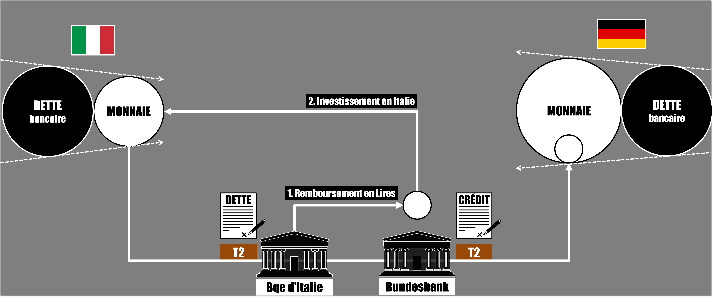

# SPOILER ALERT !!! Episode 30-2 : Résoudre TARGET2

## Récap de l'épisode

Il y a a priori trois options pour résoudre le problème des balances TARGET2 en cas de sortie de l'euro d'un des pays membres.

Option numéro 1, on fige les dettes et crédit TARGET2 et on n'y touche plus. Puisqu'on ne va plus échanger d'euros avec le pays sortant, il n'y a plus besoin de toucher aux mécanismes TARGET2.

Option numéro 2, le pays qui quitte l'union monétaire créer de la monnaie et rembourse les banques centrales de la zone euro. Cela permet au pays sortant de rajouter de la monnaie dans son économie. De leur côté les banques centrales européennes obtiennent des actifs financiers de ce pays en échange de l'annulation de la dette T2.

Option numéro 3, le pays sortant rembourse en euros. Tout comme l'option numéro 2 cette méthode permet au pays sortant de rajouter de la monnaie dans son économie, car la banque centrale devra créer de la monnaie pour acheter des euros. Cette méthode permet également aux banques centrales européennes de détruire le trop-plein de monnaie qui était présent de leur côté.

Toutes ces méthodes sont transparentes pour les ménages et les entreprises des pays concernés. Le remboursement des dettes TARGET2 en cas de sortie d'un pays membre ne nécessite absolument pas la levée de nouvelles taxes et impôts.

Cela dit, le simple fait que les mécanismes TARGET2 font appel à de la “Dette” peut provoquer une mécompréhension de l'existence purement technique de cette dernière. L'idéologie politico-économique de certains pourrait transformer ce faux problème en une véritable tragédie.

## Sources

Ulrich Bindseil, Philipp Johann König, [The economics of TARGET2 balances](http://sfb649.wiwi.hu-berlin.de/papers/pdf/SFB649DP2011-035.pdf)

Paul DE GRAUWE, Yuemei JI, Corrado MACCHIARELLI, [TARGET (im)balances at record level: Should we worry?](http://www.europarl.europa.eu/RegData/etudes/IDAN/2017/607365/IPOL_IDA(2017)607365_EN.pdf)

Karl Wehlan, [Should we be concerned about TARGET balances?](http://www.europarl.europa.eu/RegData/etudes/IDAN/2017/607366/IPOL_IDA(2017)607366_EN.pdf)
