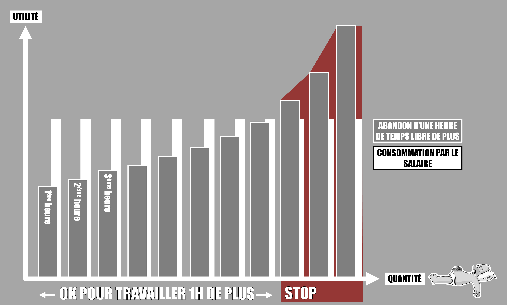
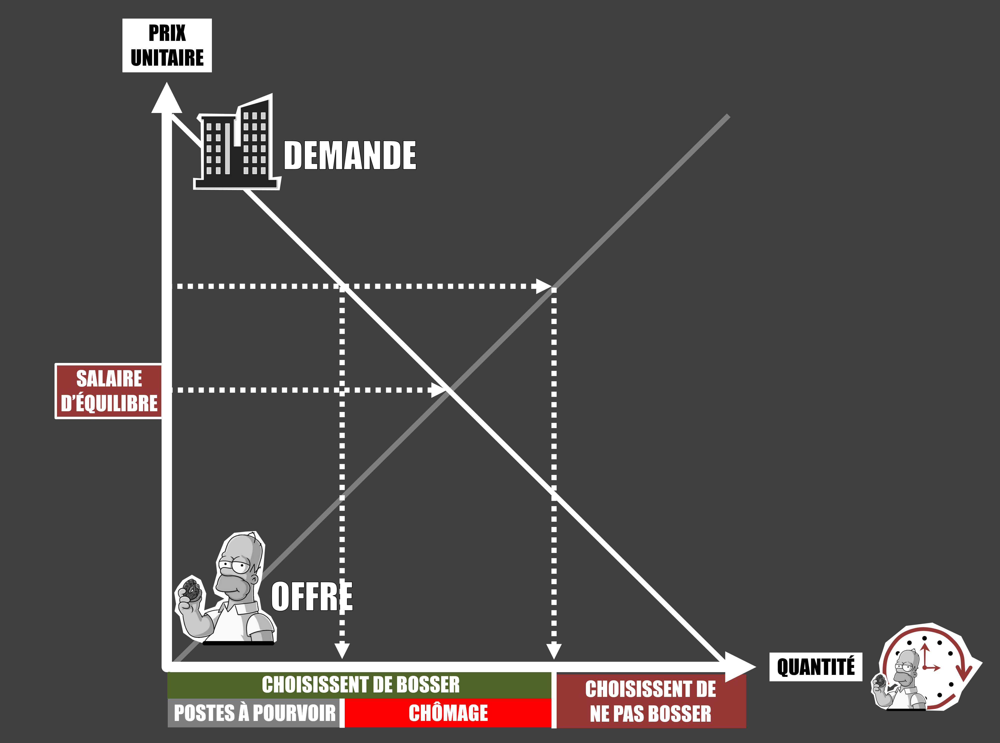

# Episode 32-01 : Le chômage pour les nuls (Comprendre la théorie dominante)

## Graphiques et schémas

1/ La productivité des travailleurs est strictement décroissante. Cela s'expliquerait par le capital qui, de par sa quantité limitée, présente une contrainte structurante dont les entreprises doivent tenir compte avant d'embaucher des travailleurs. Un ouvrier pour une brouette, la productivité est forte. Deux ouvriers pour la même brouette, la productivité diminue. La logique est pertinente si on part du principe que le nombre de brouettes est connu avant d'embaucher les ouvriers ce qui n'a pas vraiment de sens. Les entreprises recrutent les ouvriers d'abord (en fonction de la production qu'elles visent) puis s'arrangent dans un second temps pour fournir une brouette à tout le monde (quitte à en faire produire si nécessaire). Bref, s'il y a bien des formes de capital qui sont présentes en quantités limitées (terres exploitables, ressources minières), certaines autres formes de capital (brouettes, stylos, ordinateurs, voitures, avions...) représentent des variables dont les quantités ne sont pas connues à l'avance.

2/ Les travailleurs abandonnent du temps libre pour travailler. Comme il n’y a que 24h par jours et qu’il faut bien trouver le temps de dormir, de manger et de profiter de certains loisirs, plus on demande aux travailleurs de travailler longtemps, plus la perspective de n’avoir que très peu de temps libre rend l’abandon de chaque heure supplémentaire très couteuse. Quand l’abandon de l’heure supplémentaire de temps libre coûte plus d’utilité que n’en rapporte la consommation issue du salaire reçu, le travailleur décide volontairement d’arrêter de travailler. La logique est de considérer que le travailleur n’a aucune contrainte physique et sociale qui l’obligerait à trouver un emploi. Pas besoin de revenu pour vivre, pas besoin de travailler pour s’intégrer etc.

## Sources

Laurent CORDONNIER - [Pas de pitié pour les gueux : sur les théories économiques du chômage](https://www.amazon.com/piti%C3%A9-pour-gueux-Laurent-Cordonnier/dp/2912107113)

Marc LAVOIE - [Post keynesian economics: New foundations](https://www.amazon.com/Post-Keynesian-Economics-Foundations-Marc-Lavoie/dp/184720483X/ref=sr_1_1?keywords=marc+lavoie+post+keynesian&qid=1570053118&s=books&sr=1-1)

