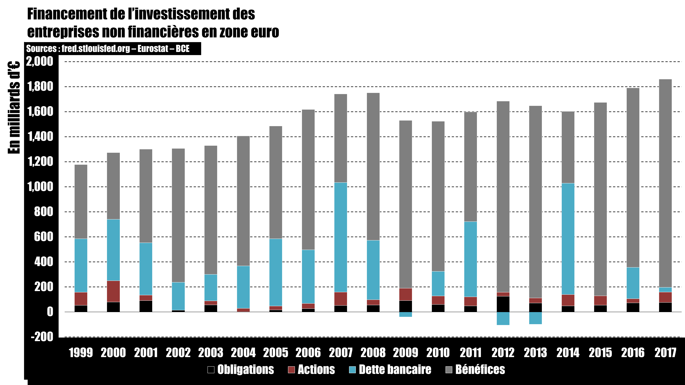

# Episode 32-01 : Le chômage pour les nuls (Comprendre la théorie dominante)

## Graphiques et schémas

## Sources

Laurent CORDONNIER - [Pas de pitié pour les gueux : sur les théories économiques du chômage](https://www.amazon.com/piti%C3%A9-pour-gueux-Laurent-Cordonnier/dp/2912107113)
Marc LAVOIE - [Post keynesian economics: New foundations](https://www.amazon.com/Post-Keynesian-Economics-Foundations-Marc-Lavoie/dp/184720483X/ref=sr_1_1?keywords=marc+lavoie+post+keynesian&qid=1570053118&s=books&sr=1-1)

