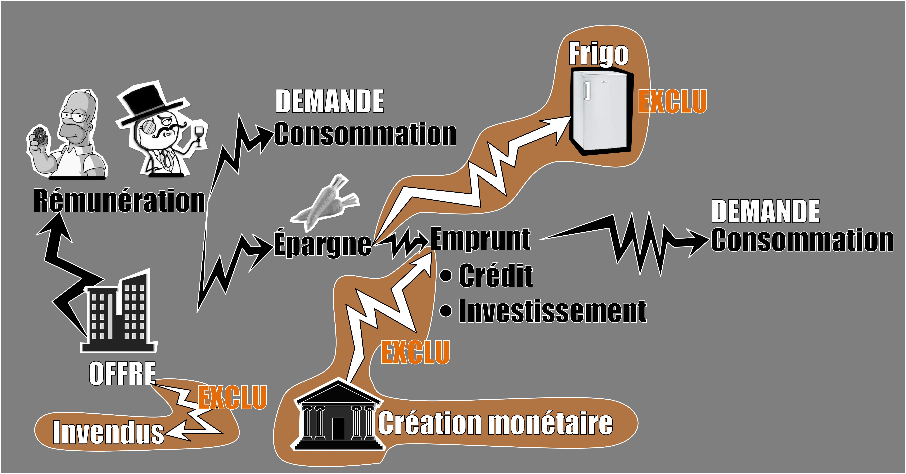
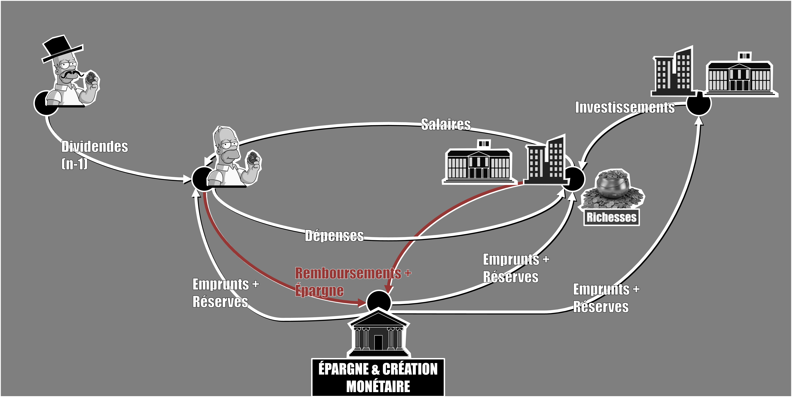

# Episode 32.2 : Le chômage pour les nuls - Faut-il tenir compte de la demande ?

La question posée par l'épisode est la suivante : pourquoi les modèles de l'orthodoxie ne tiennent-ils pas compte de la demande ? Pourquoi faut-il toujours plutôt mener une politique de l'offre plutôt que de la demande ?

## La demande selon l'orthodoxie

Le raisonnement tenu par les orthodoxes aboutit à la conclusion que l'offre (la production) provoque toujours l'apparition d'une demande (consommation) suffisante pour écouler l'ensemble des biens et des services produits. Cette conclusion, que l'on appelle la loi de Say repose sur deux hypothèses :

1/ Il n'y a pas de monnaies dans le modèle (modèle de troc)
2/ Les épargnants ne sont motivés que par l'appât du gain.

La démonstration de la loi de Say se fait de la manière suivante :

1/ Les entreprises produisent puis rémunèrent travailleurs et capitalistes. Il n'y a pas de processus de vente des biens et des services produits si bien qu'il ne peut pas y avoir d'invendus ou de stocks inutilisés. La production est simplement répartie entre travailleurs et capitalistes. Cela signifie que les entreprises rémunèrent directement en patates, carottes, téléviseurs etc.

Offre = Production = rémunération

2/ Certains particuliers (travailleurs et/ou capitalistes) décident d'épargner plutôt que de consommer leur rémunération. Cela signifie qu'ils choisissent de se priver de l'utilisation (donc de la consommation) des biens et des services qu'ils ont reçu en guise de rémunération. La théorie n'intègre pas le fait que cette privation puisse se faire sans une compensation. Si certains décident d'épargner, c'est que d'autres sont prêts à leur payer un intérêt en échange de la possibilité d'utiliser leur propriété. Ainsi, si personne ne paye d'intérêt, personne n'épargne et tout le monde consomme. On en déduit que les biens et services épargnés sont nécessairement utilisés (donc consommés) par d'autres. L'épargne est donc une étape intermédiaire de la consommation. Tout ce qui est produit sert de rémunération et tout ce qui est rémunéré est également consommé. L'offre (la production) provoque sa propre demande (consommation).

Rémunération = Consommation (directe) + Epargne
Epargne = Crédit à la conso + Investissement = Consommation (indirecte)
Demande = Conso (directe + indirecte)

Donc : Offre = Demande

## La demande selon l'hétérodoxie

Dans les modèles monétaires utilisés par les postkeynésiens, la loi de Say n’a pas de raison d’être systématiquement vérifiée. Selon eux, la production des entreprises est avant tout déterminée par la demande car les entreprises ajustent leur production en fonction du remplissage du carnet de commande. 

Or cette demande dépend de plusieurs variables :

* Les revenus des actionnaires issus des bénéfices de l'année précédente
* Les dépenses de consommation ou d'investissement issus de la création monétaire
* Celles issues de l'utilisation de l'épargne.
* Et enfin celle permise par le salaire, qui dépend du nombre de travailleurs employés et du niveau des salaires.

Ainsi, s'il est vrai que la production des entreprises, l'offre, tend à s'ajuster sur la demande parce que les entreprises ne veulent produire ni plus ni moins que ce qu'elles réussiront à vendre, c'est uniquement la hausse de la demande qui peut provoquer la hausse de l'offre. Les carnets de commande doivent être plein à craquer pour déclencher : embauche de travailleurs et investissements. Ainsi, dans les modèles post-keynésiens, résoudre le problème du chômage passe par l'augmentation des différents paramètres qui forment la demande. 

## Sources

Laurent CORDONNIER - [Pas de pitié pour les gueux : sur les théories économiques du chômage](https://www.amazon.com/piti%C3%A9-pour-gueux-Laurent-Cordonnier/dp/2912107113)

Marc LAVOIE - [Post keynesian economics: New foundations](https://www.amazon.com/Post-Keynesian-Economics-Foundations-Marc-Lavoie/dp/184720483X/ref=sr_1_1?keywords=marc+lavoie+post+keynesian&qid=1570053118&s=books&sr=1-1)
