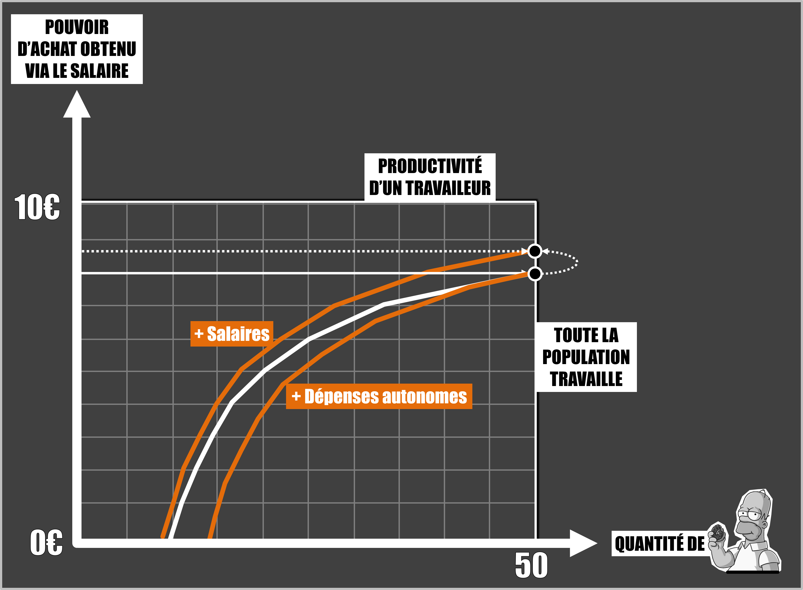

# Episode 32.3 : Le chômage pour les nuls - Le modèle Post-Keynésien

Selon les post-keynésiens, la production des entreprises est avant tout déterminée par la demande car les entreprises ajustent leur production en fonction du remplissage du carnet de commande. 

Or cette demande dépend de 2 variables :

* Ce que l’on a appelé les dépenses autonomes qui regroupent :
  * Les revenus des actionnaires issus des bénéfices de l'année précédente
  * Les dépenses de consommation ou d'investissement issus de la création monétaire
  * Et celles issues de l'utilisation de l'épargne.
* Et la variable salariale, qui dépend du nombre de travailleurs employés et du niveau des salaires.

L’offre quant à elle, dépend de la productivité des travailleurs que l’on considère ici comme constante, et du nombre de travailleurs employés.

Selon les post-keynésiens, une économie capitaliste va naturellement chercher un équilibre pour que l’offre soit égale à la demande et celui-ci peut s’obtenir à tous les niveaux de salaires. Contrairement aux néoclassiques qui ne perçoivent qu’un seul salaire permettant à offre et demande d’être égaux, les post-keynésiens tracent une courbe qui représente tous les équilibres possibles à tous les niveaux de salaire. L’idée est donc de tenter d’influencer les agents économiques afin que le bon équilibre, celui qui permet le plein emploi, soit obtenu.

Contrairement au modèle néoclassique, l’automatisation de la production qui permet une meilleure productivité des travailleurs provoque du chômage car elle augmente l’offre sans augmenter la demande, ce qui provoque l’apparition d’une nouvelle courbe d’équilibre.

## En cas d'augmentation de la productivité

Dans le but de revenir au plein emploi, l’état doit alors agir sur la demande en forçant les entreprises à augmenter les salaires, en encourageant l’investissement dans l’économie réelle et/ou en augmentant son déficit public.

## En cas d'augmentation des dépenses autonomes

## En cas de diminution des dépenses autonomes

On peut rajouter au modèle une notion supplémentaire en intégrant une variable de balance commerciale. En effet, il est toujours possible pour les entreprises si la demande est inférieure à l’offre, de tenter de vendre les marchandises en excès à d’autres pays. On obtient alors la relation suivante : plus la balance commerciale d’un pays est excédentaire, càd plus la production d’un pays est supérieure à sa demande, plus les dépenses autonomes et les salaires risquent d’y être faibles sans que cela ne se voit au niveau du chômage. 

## En cas de balance commerciale excédentaire

*La demande est inférieure à l'offre (le pays est exportateur net). L'exccès d'offre écoulée à l'étranger permet de maintenir des salaires ou de dépenses autonomes faibles.*

A l’inverse, plus la balance commerciale d’un pays est déficitaire, càd plus la consommation d’un pays est supérieure à ce qu’il produit, plus le risque d’une crise de la dette est importante car il est peu probable que l’excès de demande soit liée à des salaires trop élevés.

## En cas de balance commerciale déficitaire

*La demande est supérieure à l'offre (le pays est importateur net). L'exccès de demande peut venir de salaires ou de dépenses autonomes élevéées.*

Pour finir, la liberté des consommateurs qui peuvent acheter sans surcoûts des produits fabriqués dans des conditions très éloignées des critères nationaux, ainsi que la liberté des entreprises de délocaliser la production comme bon leurs semble, viennent considérablement complexifier les choses. En effet, une hausse des salaires et une hausse du déficit public pourrait n’avoir aucun effet sur le chômage si les entreprises décidaient de délocaliser ou si les consommateurs ne cherchaient pas en priorité à consommer ce qui est produit localement. La solution pourrait être alors de mettre en place des tarifs douaniers pour encourager la production et la consommation nationale des pays qui se soucient réellement de résoudre le problème du chômage tout en maintenant la juste rémunération des travailleurs. Le problème, c’est que cela suppose de réaliser un arbitrage entre les pays dans lesquels on veut encourager la production qui ne verraient pas leurs exportations taxées par des tarifs douaniers, et les autres que l’on chercherait, via des tarifs douaniers, à contraindre de mieux traiter leurs travailleurs. Ainsi, la mise en place de tarifs douaniers ne peut être envisagée qu'à l'issue d'une négociation internationale sans quoi elle risquerait de mener à une guerre commerciale plutôt qu’à une amélioration de la situation des travailleurs en termes de création d’emploi et de pouvoir d’achat.

## Sources

Laurent CORDONNIER - [Pas de pitié pour les gueux : sur les théories économiques du chômage](https://www.amazon.com/piti%C3%A9-pour-gueux-Laurent-Cordonnier/dp/2912107113)

Marc LAVOIE - [Post keynesian economics: New foundations](https://www.amazon.com/Post-Keynesian-Economics-Foundations-Marc-Lavoie/dp/184720483X/ref=sr_1_1?keywords=marc+lavoie+post+keynesian&qid=1570053118&s=books&sr=1-1)
